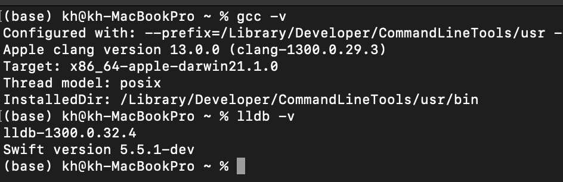
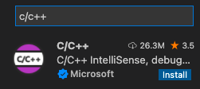
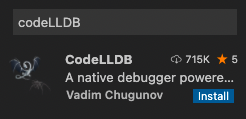
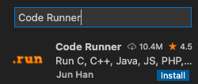
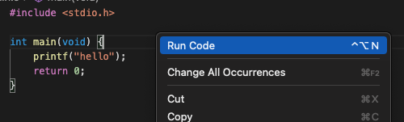
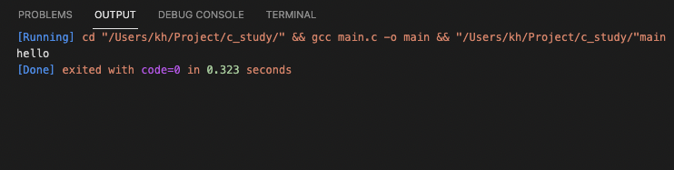
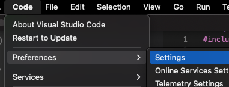
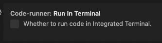

Mac OS에서 C언어를 사용하려면 주로 xcode, CLIon, VS code를 이용한다고 합니다.

그중 저는 Widnow를 사용할 때 VS code를 많이 이용해서 VS code로 개발 환경을 구축해 보겠습니다.

# VS CODE 설치

첫 번째로 VS code를 설치해 줍니다.

[VS Code Download](https://visualstudio.microsoft.com/ko/)

# 컴파일러, 디버거 설치하기
VS code는 텍스트 에디터이기 때문에 컴파일러를 따로 설치해야 합니다.

따라서 terminal로 gcc (컴파일러)와 lldb (디버거)가 설치되어 있는지 확인하고 설치하겠습니다.

다음과 같이 gcc -v, lldb -v를 했을 때 버전이 나오면 설치가 되어있는 상태입니다.



만약 설치가 안 된 상태이면 다음과 같이 설치하면 됩니다.

    brew install gcc

# VS Code 초기 세팅



C/C++과 CodeLLDB를 Extension을 추가하면 됩니다.

그리고 빌드를 위해서 Code Runner Extension을 추가로 설치하겠습니다.



그러면 에디터에서 우 클릭을 통해 코드를 실행할 수 있습니다.


이제 실행할 경우 다음과 같이 잘 실행되는 것을 볼 수 있습니다.


문제는 여기서 출력 결과가 OUTPUT 탭을 통해서 출력되기 때문에 사용자로부터 입력을 받을 수 없다는 점입니다.

그 문제를 해결하려면 code - preferences - settings - code runner 검색 - Run In Terminal 체크를 진행해 주면 됩니다.





# 번외. GCC 명령어로 컴파일 하기

다음과 같이 gcc 명령어를 이용하면 main이라는 파일 하나가 생성됩니다.

```text
gcc [소스파일] -o [출력파일]
gcc main.c -o main
```

그리고 다음 명령어를 이용해 바로 실행시키면 됩니다.

```text
./main
```

이상 MAC에서 C언어 초기 세팅하는 방법이었습니다.