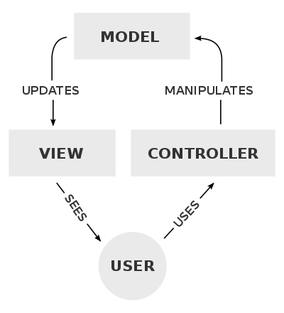

# MVC 패턴이란?

MVC 패턴은 Model-View-Controller의 약자로 프로그램을 역할로 구분해 개발하는 방법입니다. 사용자가 Controller를 조작하면 Model을 통해 데이터를
가져오고 가져온 데이터를 바탕으로 View를 통해 시각적인 처리를 하고 사용자에게 전달하게 됩니다.

- Model : 데이터와 관련된 일을 하는 부분

- View : 사용자에게 보여지는 부분
  
- Controller :  View와 Model의 중계자 역할을 하는 부분

# MVC 패턴 등장 배경

MVC 패턴이 생겨나기 전에도 프로그래머들은 수많은 프로그램들을 만들어왔습니다. 그런데 코드가 늘어나면 늘어날수록 코드를 파악하기 힘들어지고 이후 기능을 
수정하거나 추가할 때마다 코드를 수정하기 힘들어 코드를 갈아엎어야 하는 경우가 많았습니다. 실제로 저도 이번에 MVC 패턴을 공부하기 전에 프로그램을 개발할 때 
로직을 수정해야 하는데 코드가 너무 복잡해지며 결국 긴 시간 공을 들여 갈아엎어야 하는 경우가 많았습니다. 그래서 과거 개발자들이 유지보수 하기 편한 패턴들을
찾기 시작했고 그중 MVC 패턴이 등장해 인기를 얻고 있습니다.

# MVC 패턴의 구성

## Model
 
사용자가 편집하기 원하는 데이터를 가지고 있는 객체입니다.

이때 Model은 Controlelr와 View에 의존하면 안됩니다. > View나 Controller에 대한 어떠한 정보도 알지 말아야 합니다.

## View

사용자가 볼 결과물을 생성하기 위한 객체입니다.

이때 View는 Model이 가지고 있는 정보를 따로 저장하면 안됩니다.

그리고 Controller에 의존하면 안됩니다.

## Controller

사용자의 조작에 따라 데이터를 가져오고, 데이터를 View에 반영해 사용자에게 반환하는 객체입니다.

이때 Controller는 Model과 View에 의존해도 됩니다.

