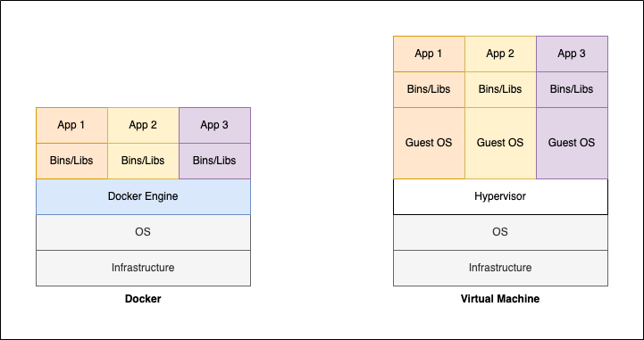

# Docker란?

Docker는 소프트웨어를 컨테이너라는 표준화된 유닛으로 패키징해 환경에 구애받지 않고 애플리케이션을 빠르고 안정적이게 배포 및 확장할 수 있는 기능을 제공하는 플랫폼입니다.

이때, 컨테이너에는 라이브러리부터, 시스템 도구, 코드, 런타임 등 소프트웨어를 실행하는데 필요한 모든 것이 포함되어있습니다.

## Docker와 Virtual Machine의 차이점

Virtual Machine의 경우 하이퍼바이저에서 Guest OS를 실행하고 그 위에서 Application을 구동시키는 방식입니다.

하지만 Docker의 경우 Guest OS없이 Docker Engine이 리소스를 각 컨테이너에 분배하고 동작하기때문에 가볍습니다.

즉, Docker는 Guest OS가 없기 때문에 VirtualMachine에 비해 훨씬 가볍습니다.



<br/>

# Docker의 기본 사용법

## Docker 컨테이너 실행하기

도커 이미지를 실행하는 방법은 다음과 같이 `docker run` 명령어를 이용해 실행이 가능합니다.

```bash
docker run --name 컨테이너이름 -d -p 8080:8080 -v ~/Desktop/myProject:/usr/app ubuntu
```

이때, 옵션으로 다음과 같이 이용이 가능합니다.

- --name : 컨테이너 이름
- -d : 백그라운드 모드 실행
- -p 호스트포트:컨테이너포트 : 컨테이너포트를 호스트포트에 연결 
- -v 로컬경로:컨테이너경로 : 컨테이너경로와 로컬경로 파일을 연동

## Docker 컨테이너 종료하기

```bash
docker rm -f Container_ID
```

## Docker 이미지 빌드하기

이미지를 빌드하기 위해서는 먼저 Dockerfile을 다음과 같이 만들어줘야 합니다.

```Dockerfile
FROM openjdk:latest

EXPOSE 8080

ADD ./build/libs/*.jar app.jar

ENTRYPOINT ["java", "-jar", "/app.jar"]
```

순서대로 해석하자면 다음과 같습니다.

- openjdk 최신 버전 기반
- 8080포트를 공개
- './build/libs/*.jar'파일을 'app.jar'이름으로 이미지에 추가
- 컨테이너 시작시 java -jar /app.jar 명령어 실행

### 기본적인 키워드

이외에도 매우 다양한 키워드를 이용해 이미지를 어떻게 만들지 정할 수 있습니다.

| 키워드 | 설명 | 예시 |
| --- | --- | --- |
| FROM | base 이미지를 지정합니다. | FROM openjdk:latest|
| WORKDIR | 작업 디렉터리를 전환합니다. | WORKDIR /usr/app |
| RUN | 주어진 명령어를 실행합니다. | RUN apk add curl |
| ENTRYPOINT | 컨테이너를 시작할 때 실행되어야 하는 커맨드를 지정합니다. |  ENTRYPOINT ["java", "-jar", "/app.jar"] |
| CMD | 이지지 실행 시 디폴트 커맨드 또는 파라미터를 설정합니다. | CMD echo "컨테이너 실행시 echo 명령이 없으면 해당 문장 출력" |
| EXPOSE | 컨테이너가 공개할 포트 및 프로토콜을 설정합니다. | EXPOSE 8080|
| COPY | 이미지의 파일 시스템으로 파일 또는 디렉터리를 복사합니다. | COPY ./build/libs/*.jar app.jar | 
| ADD | 이미지의 파일 시스템으로 파일 또는 디렉터리를 복사합니다. | ADD ./build/libs/*.jar app.jar |
| ENV | 환경변수를 설정합니다. | ENV key value |
| ARG | 빌드 시 넘어올 수 있는 인자를 설정합니다. | ARG myArg <br/> ARG myArg2=defaultValue|

이후 다음 명령어를 이용해 이미지를 빌드하면 됩니다.

```bash
docker build -t 이미지이름 .
```

## Docker Compose로 다중 컨테이너 빌드 및 실행하기

마이크로서비스와 같은 경우 각각의 마이크로서비스를 도커로 실행합니다. 

그러면 컨테이너 실행 명령어를 각각의 마이크로서비스별로 실행해줘야하는 번거로움이 있습니다. 

이런 문제점을 해결 가능하도록 제공되는 기능이 바로 Docker Compose입니다.

다음과 같이 사용할 컨테이너의 빌드 옵션을 설정합니다.

### docker-compose.yml 작성하기

```yml
version: '2.1'

services:
  이름:
    build: microservices/myService # 도커 이미지 빌드에 사용할 Dockerfile 위치
    mem_limit: 350m # (메모리를 350m로 제한)
    environment:
      - Key=value

  이름2:
    build: microservices/myService2 
    mem_limit: 350m
    environment:
      - Key=value
```

### 빌드하기

```bash
docker-compose build
```

### 실행하기

```bash
docker-compose up -d
```

### 종료하기

```bash
docker-compose down
```

# 출처 및 참고
- [Docker란 무엇입니까 - AWS](https://aws.amazon.com/ko/docker/)
- [Docker와 VM의 차이점](https://hu-nie.tistory.com/entry/Docker-%EC%99%80-VM%EC%9D%98-%EC%B0%A8%EC%9D%B4%EC%A0%90)
- [[Docker] Dockerfile 개념 및 작성법](https://wooono.tistory.com/123)
- [Dockerfile에서 자주 쓰이는 명령어](https://www.daleseo.com/dockerfile/)