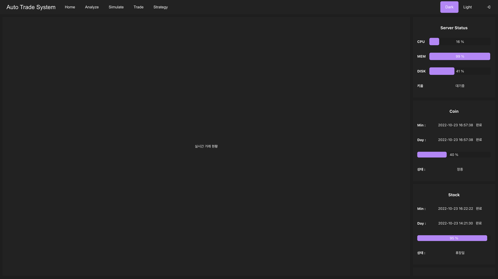
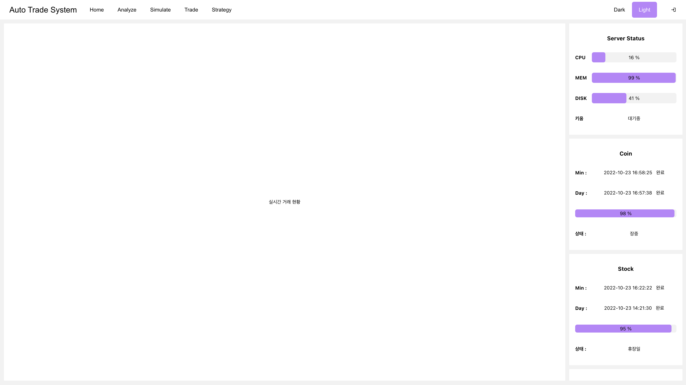

이번에 정리할 프로젝트는 아직 완성하지 못하고 개발중인 자동 거래 시스템입니다.

원래 CLI 환경에서 개발하고, 아쉬운 부분이 많아 졸업 프로젝트로 다시 개선했지만, 여러가지 문제점을 마주했습니다.

# 문제점

1. 거래 전략 시스템의 제한된 기능
    
    처음에는 거래 전략을 구성할때, 매수 조건식에 만족하면 매수하고, 매도 조건식에 만족하면 매도하는 등 로직이 매우 단순하게 구현을 했습니다.

    하지만 실제로 유용한 전략을 구현하기 위해 사용하니 필요한 로직을 구현하는 것이 불가능 했습니다.

2. 운용 환경이 Window에서 Mac으로 이전함에 따른 Window 프로그램 실행 불가

    처음에는 제가 Mac 환경에서 개발하고 사용할 줄 몰랐습니다. 그래서 그저 Window 환경에서 개발하기 시작했고,  GUI 환경에서 사용하기 위해 C#의 Window Form으로 구현했습니다.

    이후 Mac 환경에서 동작하지 못하는 문제점을 보니 키움 증권의 API는 OCX 방식의 API이기 떄문에 윈도우 환경에서만 동작이 가능하고, GUI를 구현하기 위해 사용한 C#의 Window Form도 윈도우에서만 동작이 가능합니다.

3. 체계적이지 못한 코드 구조

    졸업 프로젝트를 구현할때는 그저 기능만 구현되면 된다고 생각했습니다. 그래서 코드의 구조에 대해서는 생각을 안했고, 결과적으로 Window Form을 시각화하는 코드에 거래 관련된 코드가 들어가는 등 코드 구조가 복잡해졌습니다

4. 코드의 규모가 커지면서 유지보수 및 기능 추가의 어려움

    졸업프로젝트를 최종 발표할때가 되면서 코드의 라인 수 가 약  23,000 라인을 넘어가고 코드 구조가 체계적이지 못해 예상하지 못한 오류가 발생하거나 기능을 추가하고 유지보수하는게 너무 어려워졌습니다.

# 개선사항

1. 거래 전략 시스템의 제한된 기능

    거래 전략을 구현할 때 단순히 값을 설정해서 만드는 것이 아닌 최소한의 값 설정만 하고 프로그래밍과 같이 전략을 작성 할 수 있도록 개선하기로 했습니다.

2. 운용 환경이 Window에서 Mac으로 이전함에 따른 Window 프로그램 실행 불가

    아무리 Mac 환경에서 GUI Form이 동작하도록 구현해도 키움증권 API가 Window 환경에서만 동작해 Mac에서 실행하기 어렵습니다.

         

    그래서 서버의 구조를 프론트엔드와 백엔드 그리고 Rest Kiwoom으로 나눠 구현하고자 했습니다.

    기본적으로 프론트엔드와 백엔드로 나눠 시각적인 부분과 동작 기능을 분리했습니다.  그리고 키움증권의 OCX API를 Rest API로 바꿔주는 Rest Kiwoom으로 별도로 구현했습니다.

         

    그래서 Rest Kiwoom을 제외하고 모든 운영체제에서 개발이 가능하도록 구현하고, 브라우저를 이용해 운영체제와 상관없이 이용이 가능하도록 구현했습니다.
   

3. 체계적이지 못한 코드 구조
    
    시각화 기능을 구현하는 프론트엔드와 데이터수집, 시뮬레이션, 거래 등의 동작을 구현하는 백엔드로 프로젝트를 나눴습니다. 그리고 각 기능별로 파일을 분리하고, 최소한의 동작을 함수로 구현하는 등 기능별로 분리하며 구현하고 있습니다. 

4. 코드의 규모가 커지면서 유지보수 및 추가의 어려움 

    코드의 유지보수와 기능을 추가하기 위해서는 가독성이 높고 깔끔한 코드를 구현하도록 구현하고 있습니다.

5. 거래 대상 추가

    이번 프로젝트를 만들기 시작하며 주식 뿐만 아니라 코인 또한 유사하게 거래가 가능하기 때문에 코인도 트레이딩이 가능하도록 구현하고 있습니다. 

# 개발 환경

- Frontend : React
- Backend : Spring
- Rest Kiwoom : Python (Flask)
- Database : MySQL, MongoDB

# 화면 구성

## 홈화면

처음 접속하면 다음과 같이 홈화면이 나타납니다. 이때 우측에는 서버의 상태와, 코인/주식 데이터 수집 현황을 확인 할 수 있도록 구현했습니다.

그리고 향후 남은 여백에 실시간 거래 현황을 시각화해 추가할 예정입니다.

그리고 우측 상단의 Light 버전을 누르면 다음과 같이 Light Mode로 변경이 가능하도록 구현했습니다

## 분석 화면

헤더의 Analyze 탭을 누르면 다음과 같이 데이터를 차트로 분석이 가능합니다.

이때 마우스 휠을 굴려 확대 및 축소가 가능하도록 구현했고, 마우스를 드래그해 이전 데이터를 확인 하고, 끝까지 드래그 한 경우 이전 데이터 또는 이후 데이터를 요청해 시각화하도록 구현했습니다.

이때 죄측 상단의 검색창을 이용해 다음과 같이 종목을 검색 및 선택 가능하고 화살표 버튼을 눌러 이전 종목 또는 이후 종목을 분석 할 수 있습니다.

  
  

검색창을 클릭하면 좌측 이미지와 같이 종목들을 보여줍니다.

그리고 검색창에 값을 입력하면 우측 이미지와 같이 입력한 정보에 해당하는 종목들을 보여줍니다.

또, 검색 창 옆에 있는 Indicator 버튼을 누르면 다음과 같이 보조지표 선택 화면이 나타납니다.

이때 원하는 보조지표를 추가하거나, 기존에 추가한 보조지표를 수정할 수 있습니다.

그리고 다음 이미지와 같이 프리셋 저장/불러오기를 클릭해 추가한 보조지표들을 프리셋으로 저장하고 불러올 수 있도록 구현했습니다.

또 우측 상단에 있는 시간 단위를 선택하면 다음과 같이 여러 시간 단위를 동시에 분석 할 수 있도록 구현했습니다.

이때 드래그하며 이전/이후 데이터를 확인하는 경우 다른 시간 단위의 차트도 동기화 해 같은 시간대를 확인 하도록 구현했습니다.

그리고 그 옆에 있는 도구 버튼을 클릭해 다음 과 같이 주석을 추가하도록 구현했습니다.

## 전략 화면 (수정중)

헤더에서 Strategy 탭을 누르면 다음과 같이 전략 목록을 보여줍니다.

이때 작성하기 버튼을 눌러 새로운 전략을 만들거나 기존의 전략을 클릭해 전략을 수정할 수 있습니다.

아래 사진은 전략의 편집 화면입니다.

좌측 화면에서 데이터를 정의하거나 변수를 선언할 수 있고, 우측 상단에서 전략의 이름과, 거래 분야, 종목 등을 선택할 수 있습니다.

그리고 우측 하단에서 거래 전략의 행동 방식을 프로그래밍 언어와 같이 작성하도록 구현하면 해당 코드를 해석해 동작하도록 구현중입니다.

이때 데이터 및 변수 정의 또는 행동을 정의하는 편집 화면에서 IDE와 같이 자동완성 기능을 구현했습니다.

## 시뮬레이션 화면

헤더에서 Simulate 탭을 누르면 다음과 같은 화면이 나타납니다.

이때 우측 상단에서 시뮬레이트를 선택 할 수 있고, 우측 하단에서 다음과 같이 시뮬레이트 환경을 확인하거나 설정할 수 있습니다.

  

이후 시작 버튼을 누르면 시뮬레이트 진행 현황을 WebSocket을 이용해 실시간으로 확인할 수 있도록 구현했습니다.

그리고 시뮬레이트를 완료하면 다음과 같이 분석 정보를 확인 할 수 있도록 구현했습니다.

우선 시뮬 정보 탭을 눌러 기본적인 분석 정보와 자산의 변화 현황을 확인 할 수 있도록 구현했습니다. 

그리고 전략이 잘 거래하는지 확인하기 위해 시뮬레이트 거래 기록을 분석 할 수 있습니다.

이때 좌측 하단에서 거래했던 기록들을 확인 할 수 있습니다.

그리고 상단에서 분석 활용을 재사용해 언제 매수했고, 언제 매도했는지 시각적으로 구현했습니다. 

이후 분석 정보 탭으로 이동하면 

전략이 매수 후 특정 가격에 무조건 팔도록 구현해서 단순하지만 아래 이미지와 같이 분석 할 수 있도록 구현했습니다.  

## 거래 화면 (향후 구현 예정)

거래 기능 구현은 이번 프로젝트의 최종 단계이기 때문에 아직 구현하지 못했습니다.

# 향후 계획

현재 개발 상황은 전략을 더 다양한 행동과 분석이 가능하도록 개선하고 있습니다.

이후 다음 개발 순서대로 프로젝트를 완성해나갈 계획입니다.

1. 개선된 전략을 이용해 시뮬레이션이 가능하도록 시뮬레이션에서 전략을 사용하는 부분을 개선할 예정입니다.
2. 전략을 더욱 확실하게 분석하기 위해 분석 화면에서 전략을 선택할 경우 전략이 사용하는 데이터와 어떤 의사결정을 하는지 시각적으로 표현하도록 구현할 예정입니다.
3. 거래 기능은 실제 자산을 가지고 거래합니다. 따라서 실제 거래하는 기능을 구현하기 전에 로그인 기능을 구현해 권한이 없는 사용자가 이용이 불가능하도록 구현할 예정입니다.
4. 마지막으로 실제 거래기능을 구현하고 프론트엔드에서 시각화 하도록 구현할 예정입니다.

