이번에 우아한 테크코스를 신청하면서 기존에 해봤던 프로젝트들을 기록할 필요성을 느꼈습니다.

비록 미숙하고 아쉬운 부분이 많지만 정리하고 기록하고자 합니다.

# 개요

시스템 트레이딩을 구현하기 위해서는 크게 데이터수집, 데이터 분석, 전략 구성, 시뮬레이트, 실 거래로 나눌 수 있습니다.

# 데이터 수집
첫번째로 데이터를 수집하기 위해 키움증권의 OCX API를 이용해 다음 이미지와 같이 데이터베이스에 저장하도록 구현했습니다.

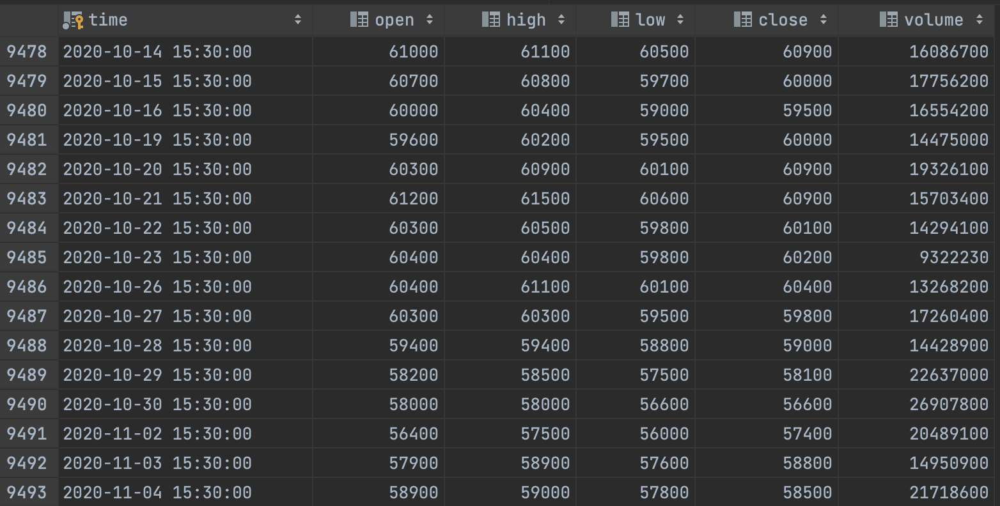

# 홈화면

사용자가 수집한 데이터를 이용해 다양한 조작을 하기 위해 C#의 Window Form을 이용해 다음과 같이 GUI 환경으로 구현했습니다.

기본 홈화면은 다음과 같이 기본적인 상태를 확인할 수 있도록 구현했습니다.

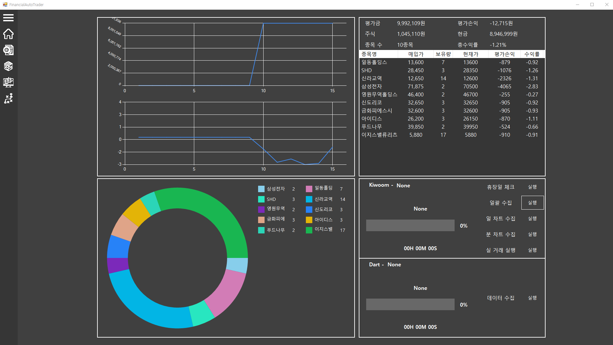

각 화면은 다음과 같이 구성했습니다. 

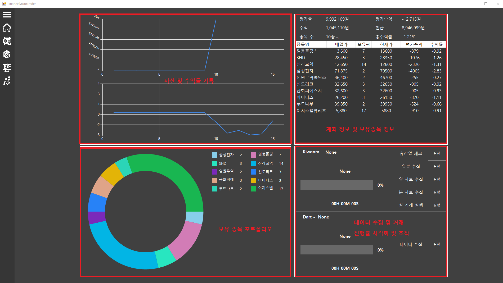

# 데이터 분석

분석 화면으로 이동 시 다음과 같이 차트를 이용해 수집한 데이터를 확인 하고 분석 할 수 있도록 구현했습니다.

해당 화면에서 원하는 종목을 검색하고 다양한 분석도구와 보조지표, 재무제표 등을 이용해 주가가 어떤패턴이 있는지 분석할 수 있는 기능을 제공합니다.

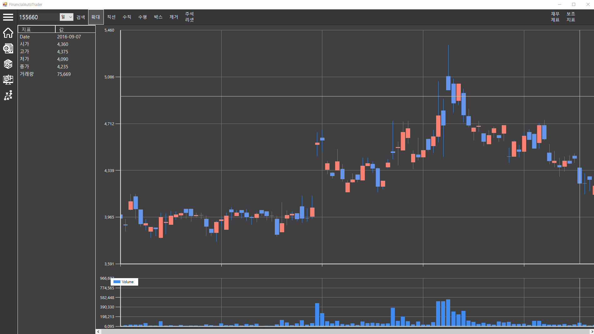

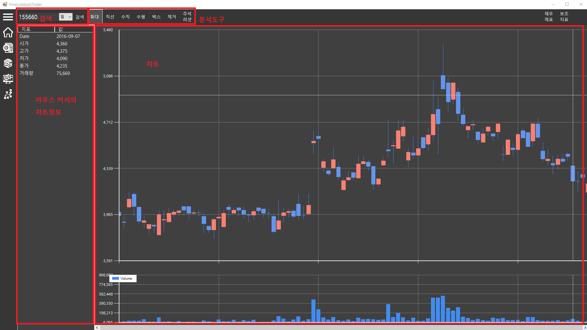

그리고 우측 상단의 재무제표 버튼이나 보조지표 버튼을 클릭하면 아래 사진과 같이 보저지표 선택 화면이 나타나고
원하는 지표를 선택해 다음과 같이 시각화 할 수 있습니다.

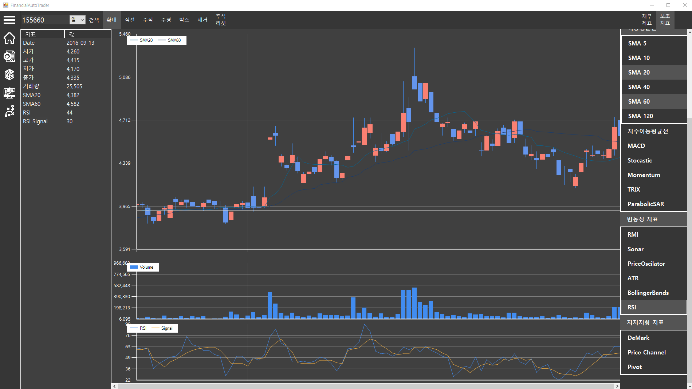

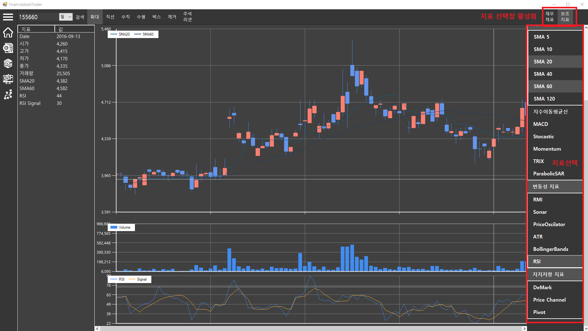

# 전략 구성

이제 분석한 데이터를 이용해 거래 전략을 다음과 같이 구현 할 수 있습니다.

아래 화면과 같이 전략의 기본적인 옵션을 지정하거나 우측 상단의 불러오기 버튼을 클릭해 기존에 작성했던 전략을 불러올 수 있도록 구현했습니다.

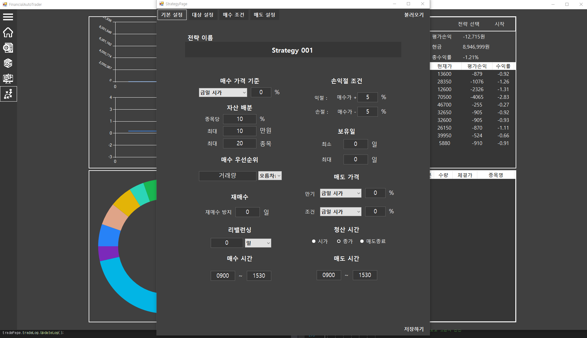
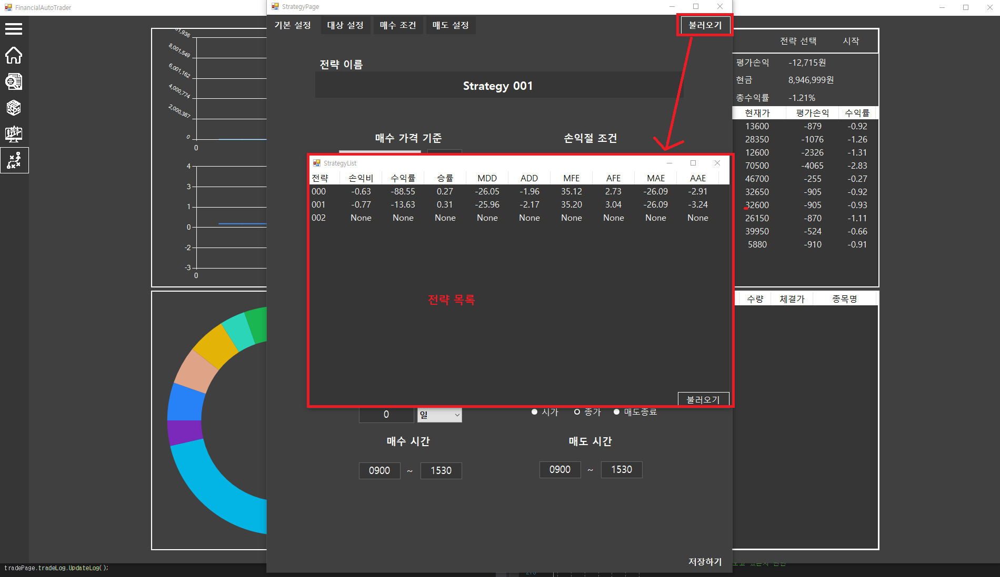

이후 좌측 상단의 대상 설정 탭으로 이동해 다음과 같이 종목 시장이나 산업을 선택 할 수 있도록 구현했습니다.

그리고 매수조건과 매도조건을 다음과 같이 조건 셀을 입력하고 최종 조건을 입력해 거래 행동을 할 수 있도록 구현했습니다.

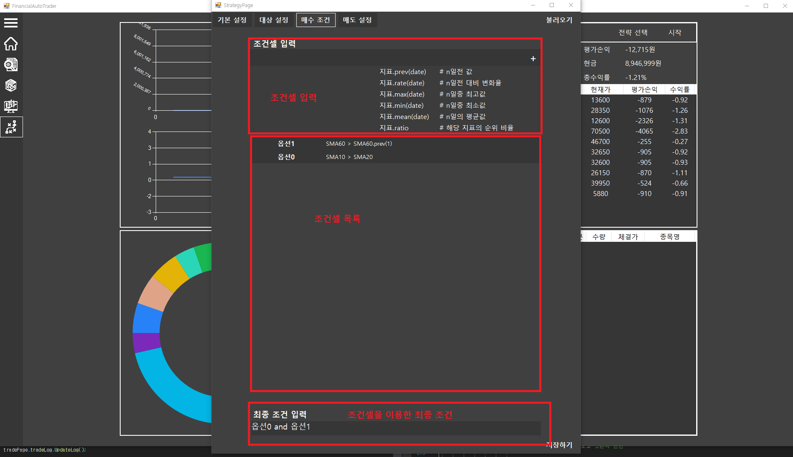

# 시뮬레이트

이전에 만든 전략을 이용해 시뮬레이션을 진행하고 분석할 수 있도록 다음과 같이 구현했습니다.
이때 시뮬레이션은 스레딩으로 구현해 동시에 여러 시뮬레이션을 진행할 수 있도록 구현했습니다.

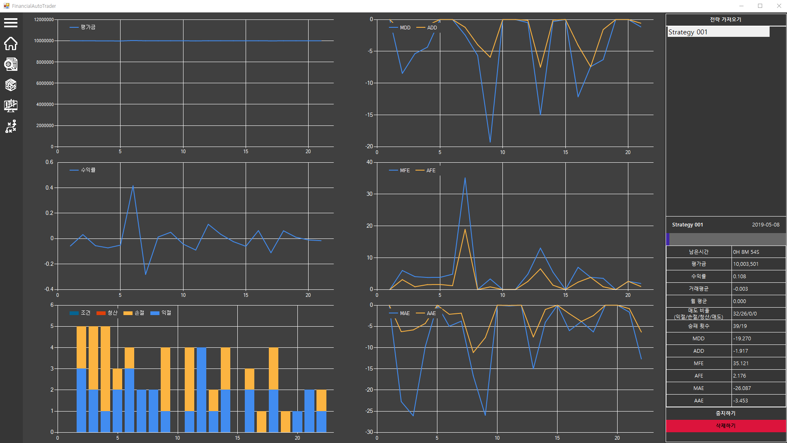
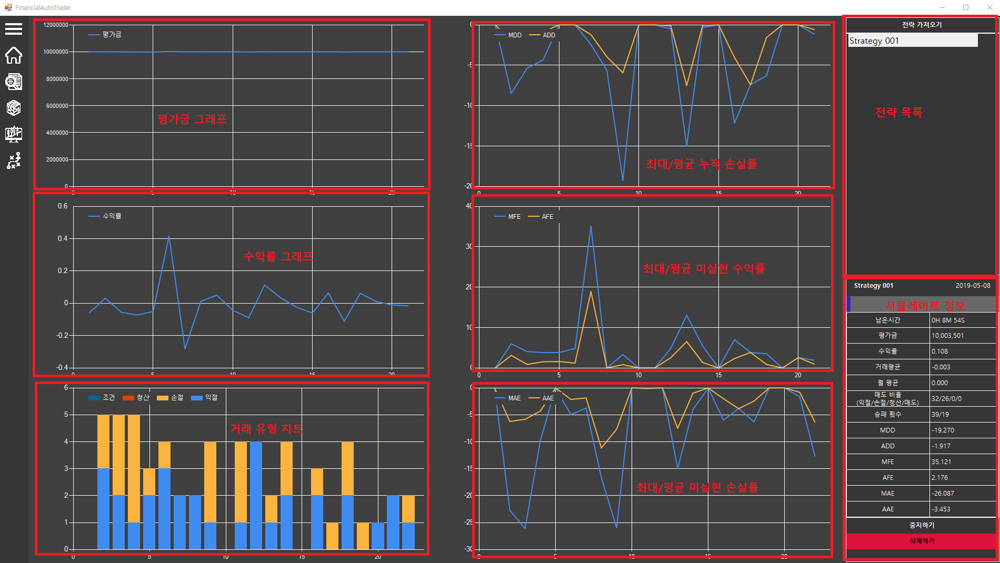

# 실 거래

이후 시뮬레이션을 통해 유용한 전략을 구현했다고 판단되면 

실 거래 페이지에 이동해 전략을 선택하고 실 거래를 진행하도록 구현했습니다.

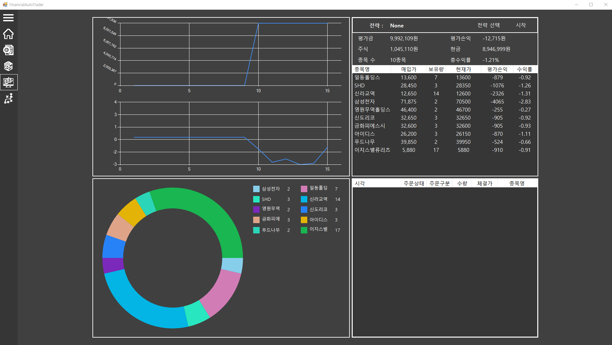
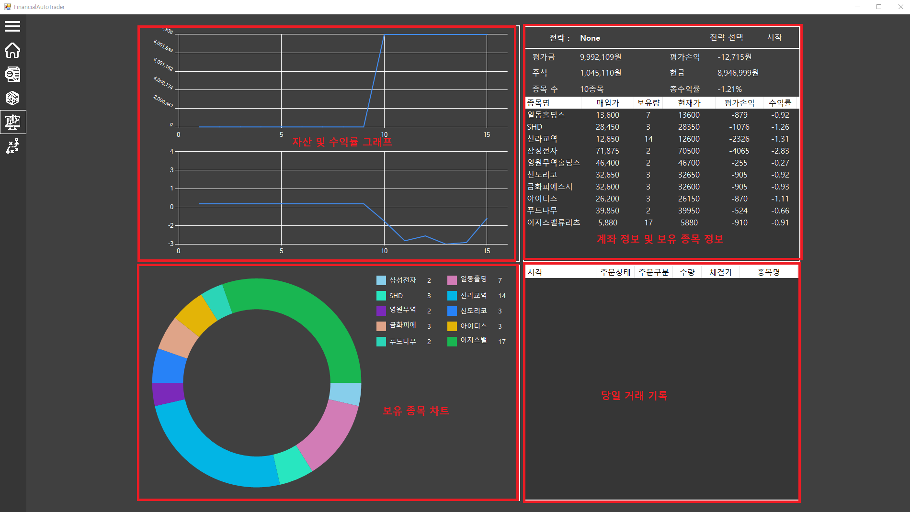
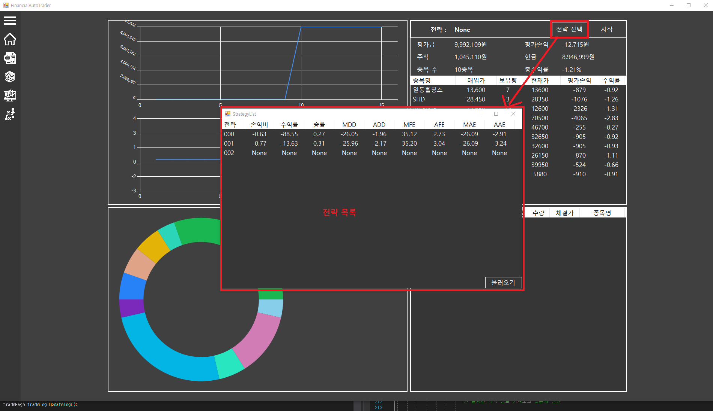
