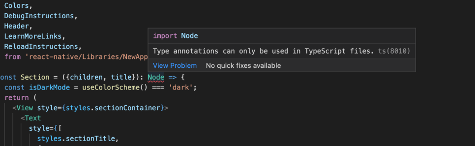
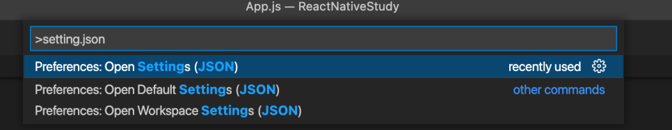
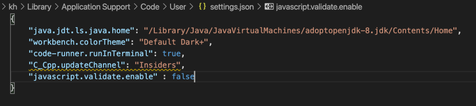
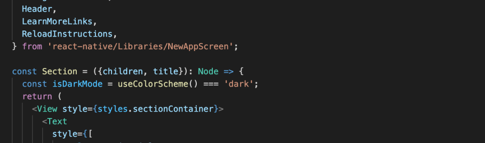

React Native 프로젝트를 생성하면 app.js에서 바로 빨간 줄이 나타나는 경우가 있습니다.

그래서 자세한 정보를 확인하면 다음과 같이 형식 주석은 TypeScript 파일에서만 사용이 가능하는 문장을 표시합니다.

해결 방법은 간단합니다.

다음과 같이 setting.json을 오픈하고 아래 코드를 추가해 주고 저장하면 해결됩니다.

    "javascript.validate.enable" : false

