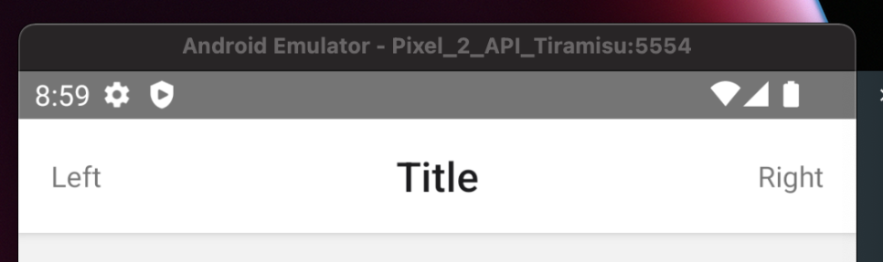

# 헤더 텍스트 변경하기

1. App.js에서 텍스트 변경하기

   
    <Stack.Screen
        name="Home"
        component={HomeComponent}
        options={{title: "홈 화면"}}
    />
   

2. 컴포넌트 내부에서 텍스트 변경하기

```javascript
navigation.setOptions({title: "홈 화면"})
```

3. 페이지 전환 파라미터로 텍스트 변경하기

```javascript
<Stack.Screen
    name="Home"
    component={HomeComponent}
    options={({route}) => ({title: route.params.name})}
    { /* navigation.navigate('Home', { name: '홈화면' }) */ }
/>
```


# 헤더 스타일 수정하기

```javascript

options={{
    title: '홈화면',
        headerStyle: {
        backgroundColor: '#234567',
    },
    headerTintColor: '#000', // 텍스트 색상
    headerTitleStyle: { // 텍스트 스타일
        fontWeight: 'bold',
        fontSize: 15,
    }
}}

```


# 헤더에 컴포넌트 배치하기

다음과 같이 옵션의 headerLeft, headerCenter, headerRight를 이용해 컴포넌트를 배치할 수 있다.

이때 타이틀이 아래 사진과 같이 왼쪽으로 편향되어 있을 수 있는데, headerTitleAlign: 'center' 옵션을 줘서 가운데로 정렬할 수 있다.

```javascript
<Stack.Screen
    name="Home"
    component={HomeScreen}
    options={ ({route}) => ({
        title:"Title",
        headerTitleAlign: 'center',
        headerLeft: MyHeaderLeft,
        headerCenter: MyHeaderCenter,
        headerRight: MyHeaderRight,
    })}
/>
```


(좌) headerTitleAlign 속성 X, (우) headerTitleAlign: 'center'

# 헤더에 뒤로 가기 버튼 숨기기

안드로이드의 경우 page를 이동하면 다음과 같이 뒤로 가기 화살표가 나오는 경우가 있습니다.

이 경우 headerBackVisible: false를 이용해 뒤로 가기를 숨길 수 있습니다.

```javascript
<Stack.Screen
    name="Sub Page"
    component={SubPage}
    options={ ({route}) => ({
        title:"Title",
        headerTitleAlign: 'center',
        headerBackVisible: false,
        headerLeft: MyHeaderLeft,
        headerCenter: MyHeaderCenter,
        headerRight: MyHeaderRight,
    })}
/>
```



(좌) headerBackVisible: true, (우)headerBackVisible: false,

# 헤더 숨기기

특정 화면의 헤더를 숨길 때는 다음과 같이 Screen의 options에 headerShown을 false로 변경하면 됩니다.

```javascript
<Stack.Screen
    name="Home"
    component={HomeScreen}
    options={({ route }) => ({
        headerShown: false,
    })}
/>
```


애플리케이션 전체 헤더를 숨길 때는 다음과 같이 Navigator의 screenOptions의 headerShown을 false로 설정하면 됩니다.

```javascript

<Stack.Navigator initialRouteName='Home'
    screenOptions={{
        headerShown: false
}}>

```
