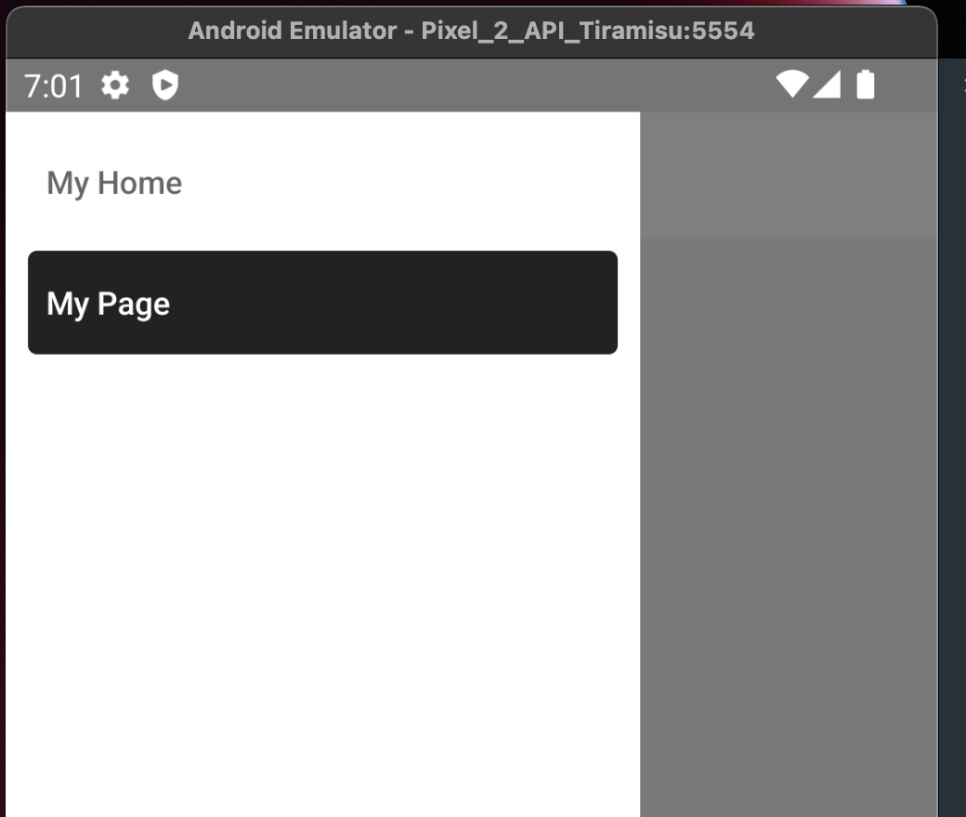

이번에는 지난 포스트에 이어 사이드 메뉴를 구현해 보려고 합니다.

우선 추가적인 라이브러리를 설치해 보겠습니다.

    npm install @react-navigation/drawer react-native-gesture-handler react-native-reanimated

기본 사용법은 스택 내비게이터와 같이 App을 감싸면서 사용합니다.

    import { createDrawerNavigator } from '@react-navigation/drawer';
    
    const Drawer = createDrawerNavigator();
    
    const App: () => Node = () => {
        const isDarkMode = useColorScheme() === 'dark';
        return (
            <NavigationContainer>
                <Drawer.Navigator
                    initialRouteName='Page1'
                    backBehavior='history'
                >
                    <Drawer.Screen
                        name="Home"
                        component={HomeScreen}
                    />
                    <Drawer.Screen
                        name="Page1"
                        component={Page1}
                    />
                </Drawer.Navigator>
            </NavigationContainer>
        );
    };

이때, Navigator에서 backBehavior를 설정할 수 있는데, 뒤로 가기를 했을 때의 행동을 지정할 수 있습니다.

- initialRoute : 첫 화면으로 돌아갑니다.

- order : Drawer.Screen 컴포넌트를 선언한 순서를 기준으로 전 화면을 보여줍니다.

- history : 현재 화면을 열기 전의 화면을 보여줍니다.

- none : 뒤로 가기 기능을 막습니다.

- firstRoute : 첫 번째의 Drawer.Screen을 보여줍니다.

그리고 내비게이션과 동일하게 options props를 이용해 커스터마이징이 가능합니다.

    
    const App: () => Node = () => {
        const isDarkMode = useColorScheme() === 'dark';

        return (
            <NavigationContainer>
                <Drawer.Navigator
                    initialRouteName='Page1'
                    backBehavior='history'
                    screenOptions: {{
                        drawerActiveBackgorundColor: '#222222', // 선택된 화면 버튼의 배경색
                        drawerActiveTintColor: '#FFFFFF',  // 선택된 화면 버튼의 글자색
                    }}
                >
                    <Drawer.Screen
                        name="Home"
                        component={HomeScreen}
                        options={{title: 'My Home'}}
                    />
                    <Drawer.Screen
                        name="Page1"
                        component={Page1}
                        options={{title: 'My Page'}}
                    />
                
                </Drawer.Navigator>
            </NavigationContainer>
        );
    };
    

