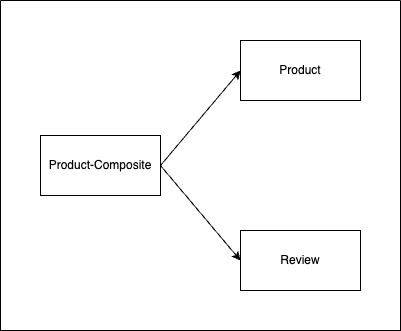
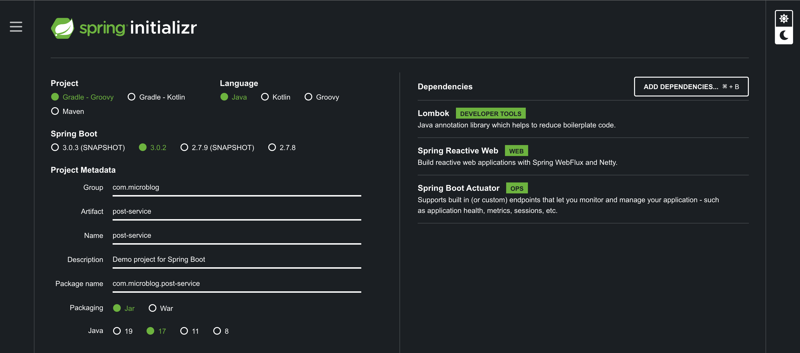
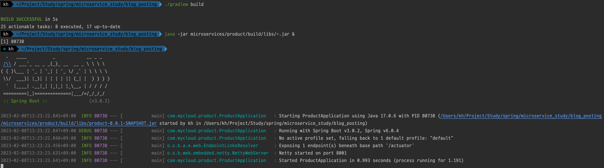
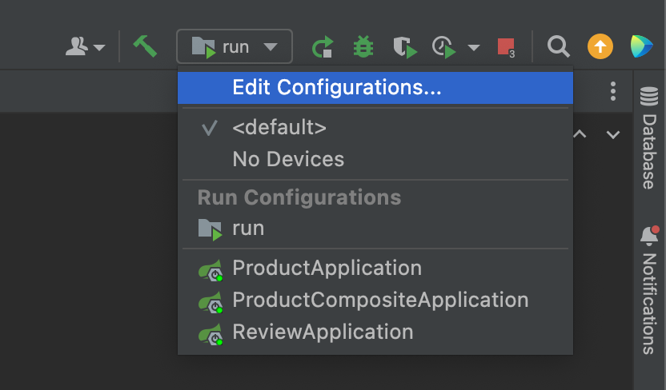
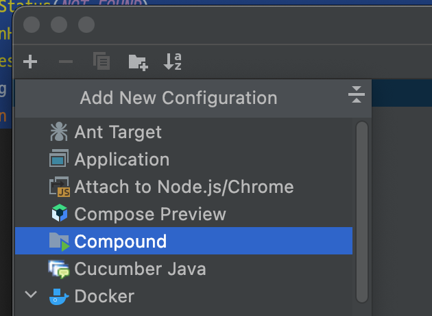
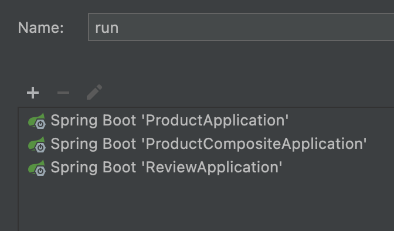
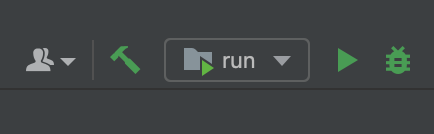
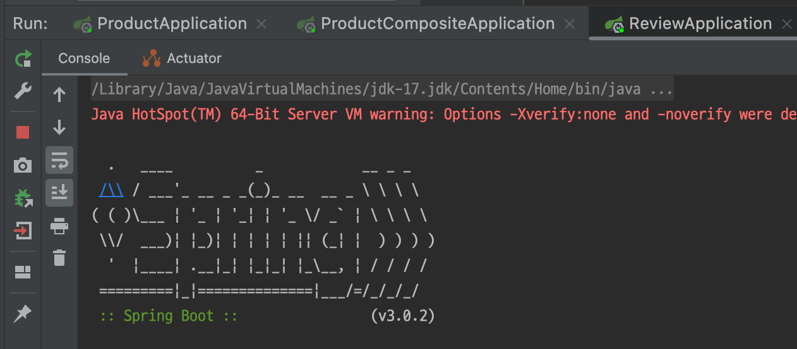
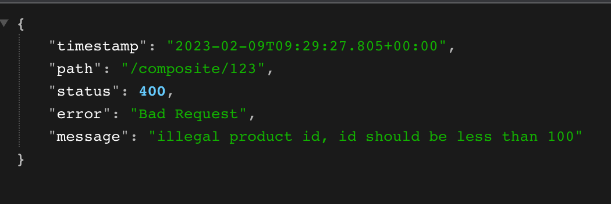

# 마이크로서비스 프로젝트 만들기

다음과 같은 구조의 매우 단순한 마이크로서비스를 한번 만들어보곘습니다.



## Spring Initializer로 Microservice Project 만들기

아래 사진과 같이 Spring Initializer를 통해 `product`, `product-composite`, `review` 프로젝트를 만들어줍니다.

### Dependency

- Reactive Web : 반응형 웹 서버를 만들기 위한 의존성

- Actuator : 애플리케이션을 모니터링하기 위한 의존성



이때 프로젝트는 다음과 같이 위치시켜줍니다.

```text
[Project Root]
 '-- microservices
     |-- product
     |-- product-composite
     '-- review
```

## 통합 Build 설정하기

### settings.gradle 작성하기

다음과 같이 settings.gradle에 작성해 빌드할 프로젝트들을 입력합니다.

```gradle
include ':microservices:product'
include ':microservices:product-composite'
include ':microservices:review'
```

### gradle 실행 파일 이동하기

다음 명령어를 입력해 product 프로젝트에 있는 gradle 파일들을 프로젝트 root 위치로 복사해줍니다.

```bash
cp -r microservices/product/gradle .
cp microservices/product/gradlew .
cp microservices/product/gradlew.bat .
cp microservices/product/.gitignore .
```

그리고 각 프로젝트에서는 gradle 파일이 필요없으므로 제거해줍니다.

```bash

find microservices -depth -name "gradle" -exec rm -rfv "{}" \;
find microservices -depth -name "gradlew*" -exec rm -rf "{}" \;

```

이때 프로젝트는 다음과 같은 구조를 가지고 있습니다.

```text
[Project Root]
 |-- gradle
 |-- microservices
 |   |-- product
 |   |-- product-composite
 |   '-- review
 |
 |-- .gitignore
 |-- gradlew
 |-- gradlew.bat
 '-- settings.gradle   
```

### build 하기

이제 terminal에서 Project의 Root에 위치해 다음과 같이 명령어를 입력하면 정상적으로 빌드되는 것을 알 수 있습니다.

```bash
$ ./gradlew build

BUILD SUCCESSFUL in 6s
```

## API와 Util Project 생성하기

이번에는 마이크로서비스의 API를 관리하는 `api` 프로젝트와 예외 및 유틸리티를 관리하는 `util` 프로젝트를 만들어줍니다.

### API Project

이번에는 메인 어플리케이션이 없는 Gradle 프로젝트를 만들어주고 다음 코드들을 직성합니다.

1. build.gradle
    
    ```gradle
    plugins {
        id 'java'
        id 'org.springframework.boot' version '3.0.2'
        id 'io.spring.dependency-management' version '1.1.0'
    }

    group = 'com.mycloud'
    version = '0.0.1-SNAPSHOT'
    sourceCompatibility = '17'
    bootJar.enabled = false

    repositories {
        mavenCentral()
    }

    dependencies {
        implementation 'org.springframework.boot:spring-boot-starter-webflux'
        
        testImplementation 'org.junit.jupiter:junit-jupiter-api:5.8.1'
        testRuntimeOnly 'org.junit.jupiter:junit-jupiter-engine:5.8.1'
    }

    test {
        useJUnitPlatform()
    }
    ```

2. 빌드 설정 및 의존성 추가

    우선 `settings.gradle`에 다음과 같이 build할 프로젝트를 추가해줍니다.

    ```gradle
    include ':api' // 추가
    include ':microservices:product'
    include ':microservices:product-composite'
    include ':microservices:review'    
    ```

    그리고 각 마이크로서비스 프로젝트마다 `build.gradle`에 다음과 같이 Project를 추가해줍니다.
    ```gradle
    dependencies {
        implementation project(':api')
    }
    ```

### Util Project

util또한 메인 어플리케이션이 없는 Gradle 프로젝트를 만들어주고 다음 코드들을 직성합니다.

1. build.gradle
    
    ```gradle
    plugins {
        id 'java'
        id 'org.springframework.boot' version '3.0.2'
        id 'io.spring.dependency-management' version '1.1.0'
    }

    group = 'com.mycloud'
    version = '0.0.1-SNAPSHOT'
    sourceCompatibility = '17'
    bootJar.enabled = false

    repositories {
        mavenCentral()
    }

    dependencies {
        implementation 'org.springframework.boot:spring-boot-starter-webflux'

        testImplementation 'org.junit.jupiter:junit-jupiter-api:5.8.1'
        testRuntimeOnly 'org.junit.jupiter:junit-jupiter-engine:5.8.1'
    }

    test {
        useJUnitPlatform()
    }
    ```
    
2. 빌드 설정 및 의존성 추가

    util 프로젝트도 api 프로젝트와 동일하게 `settings.gradle`에 다음과 같이 build할 프로젝트를 추가해줍니다.

    ```gradle
    include ':api'
    include ':util' // 추가
    include ':microservices:product'
    include ':microservices:product-composite'
    include ':microservices:review'    
    ```

    그리고 각 마이크로서비스 프로젝트마다 `build.gradle`에 다음과 같이 Project를 추가해줍니다.
    ```gradle
    dependencies {
        implementation project(':util')
    }
    ```

### 패키지 검색 설정

이제 각 마이크로서비스에서 api 프로젝트의 패키지를 검색하도록 메인 Application 프로젝트에서 @ComponentScan 어노테이션을 추가해줍니다.

```java
@SpringBootApplication
@ComponentScan("com.mycloud")
public class ProductApplication {

    public static void main(String[] args) {
        SpringApplication.run(ProductServiceApplication.class, args);
    }

}
```

이때 프로젝트 구조는 다음과 같습니다.

```text
[Project Root]
 |-- gradle
 |
 |-- api
 |-- microservices
 |   |-- product
 |   |-- product-composite
 |   '-- review
 |-- util
 |
 |-- .gitignore
 |-- gradlew
 |-- gradlew.bat
 '-- settings.gradle   
```

<br/><br/>

# 간단한 REST API 추가하기

이번에는 간단하게 Product의 ID를 입력하면 Product의 정보 및 리뷰를 가져오는 기능을 구현해보겠습니다.

## Microservice application.yml 작성하기

`product`와 `review`의 application.yml은 다음과같이 port와 logging에 대한 설정을 해줍니다.

아직 서비스를 자동으로 등록하고 관리하는 기능을 구현하지 않았기 때문에 수동으로 port를 지정해줍니다.

저는 product의 경우 `8001`번 포트, review의 경우 `8002`번 포트를 이용하겠습니다.

```yml
server.port: 8001
server.error.include-message: always

logging:
  level:
    root: INFO
    com.mycloud: DEBUG

```

그리고 복합 마이크로서비스인 `product-composite`의 경우는 다음과 같이 다른 microservice의 정보를 추가해 설정해줍니다.

```yml
server.port: 8000
server.error.include-message: always

app:
  product:
    host: localhost
    port: 8001
  review:
    host: localhost
    port: 8002

logging:
  level:
    root: INFO
    com.mycloud: DEBUG

```

## Product Service의 Rest Controller 구현

1. Product Model 만들기

    우선 첫번째로 `api 프로젝트`에서 Product Model을 만들어줍니다.

    ```java
    // api/src/main/java/.../core/product/Product.java

    public class Product {
        private final int productId;
        private final String name;
        private final int weight;

        // 생성자 및 Getter 생략
    }
    ```
2. Product Service Interface 구현

    ProductService Interface도 `api 프로젝트`에서 다음과같이 구현해줍니다.

    ```java
    // api/src/main/java/.../core/product/ProductService.java

    public interface ProductService {
        @GetMapping(value="/product/{productId}", produces="application/json")
        Product getProduct(@PathVariable int productId);
    }
    ```

3. Product Rest Controller 구현

    방금 만든 ProductService를 implements하는 방식으로 Product 프로젝트에서 세부 기능을 구현합니다.

    ```java
    // microservices/product/src/main/java/.../controller/ProductController.java

    @RestController
    public class ProductController implements ProductService {

        private static final Logger LOG = LoggerFactory.getLogger(ProductController.class);

        @Override
        public Product getProduct(int productId) {
            LOG.debug("product service return product model - product id : {}", productId);
            return new Product(productId, "product " + productId, 10);
        }
    }

    ```

4. 테스트

    이제 정상적으로 요청을 처리하는지 테스트합니다.

    ```bash
    ./gradlew build

    java -jar microservices/product/build/libs/*.jar &
    ```

    

    그리고 `http://localhost:8001/product/123`에 GET 요청을 보내면 다음과 같은 결과가 나옵니다.
    ```json
    {
        "productId": 123,
        "name": "product 123",
        "weight": 10
    }
    ```

## Product Review Controller 구현

1. Review Model 만들기

    Review Model도 `api 프로젝트`에서 만들어줍니다.

    ```java
    // api/src/main/java/.../core/review/Review.java
    public class Review {
        private final int productId;
        private final int reviewId;
        private final String author;
        private final String content;
    }

    // 생성자 및 Getter 생략
    ```

2. ReviewService 만들기

    ReviewService Interface도 `api 프로젝트`에서 다음과같이 구현해줍니다.

    ```java
    // api/src/main/java/.../core/review/ReviewService.java

    public interface ReviewService {
        @GetMapping(value = "/review", produces = "application/json")
        List<Review> getReviews(int productId);
    }
    ```

3. Review Controller 구현

    ReviewController도  ProductController와 동일하게 ReviewService 인터페이스를 implements하는 방식으로 review 프로젝트에서 세부 기능을 구현합니다.

    ```java
    // review/src/main/java/.../controller/ReviewController.java
    @RestController
    public class ReviewController implements ReviewService {
        private static final Logger LOG = LoggerFactory.getLogger(ReviewController.class);

        @Override
        public List<Review> getReviews(int productId) {

            LOG.debug("review service return review models - product id : {}", productId);

            List<Review> list = new ArrayList<>();
            list.add(new Review(productId, 1, "작성자1", "내용1"));
            list.add(new Review(productId, 2, "작성자2", "내용2"));

            return list;
        }
    }
    ```

## Product Composite Controller 구현

이제 위에서 구현한 두가지 마이크로서비스를 사용해 사용자에게 응답하는 복합 마이크로서비스를 구현해줍니다.

1. CompositeModel 만들기

    ```java
    // api/src/main/java/.../composite/ProductComposite.java
    public class ProductComposite {
        private final int productId;
        private final String name;
        private final int weight;
        private final List<Review> reviews;

        // 생성자 및 Getter 생략
    }
    ```

2. CompositeService 만들기

    ```java
    // api/src/main/java/.../composite/CompositeService.java
    public interface CompositeService {
        @GetMapping(value = "/composite/{productId}", produces = "application/json")
        ProductComposite getProduct(@PathVariable int productId);
    }
    ```

3. CompositeController 만들기

    ```java
    // product-composite/src/main/java/.../controller/ReviewController.java
    @RestController
    public class CompositeController implements CompositeService {
        private static final Logger LOG = LoggerFactory.getLogger(CompositeController.class);

        private final RestTemplate restTemplate;
        private final String PRODUCT_URL;
        private final String REVIEW_URL;

        public CompositeController(
                @Value("${app.product.host}") String productHost,
                @Value("${app.product.port}") String productPort,
                @Value("${app.review.host}") String reviewHost,
                @Value("${app.review.port}") String reviewPort
        ) {
            PRODUCT_URL = String.format("http://%s:%s/product", productHost, productPort);
            REVIEW_URL = String.format("http://%s:%s/review", reviewHost, reviewPort);
            restTemplate = new RestTemplate();
        }

        @Override
        public ProductComposite getProduct(int productId) {
            Product product = getProductFromProductService(productId);
            List<Review> reviews = getReviewsFromReviewService(productId);

            if(product == null) {
                return null;
            }

            return new ProductComposite(productId, product.getName(), product.getWeight(), reviews);
        }

        private Product getProductFromProductService(int productId) {
            String url = String.format("%s/%d", PRODUCT_URL, productId);
            LOG.debug("getProduct URL : {}", url);

            Product product = restTemplate.getForObject(url, Product.class);
            if (product == null) {
                return null;
            }

            LOG.debug("Found product id: {}", product.getProductId());

            return product;
        }

        public List<Review> getReviewsFromReviewService(int productId) {
            String url = String.format("%s/review?productId=%d", REVIEW_URL, productId);

            LOG.debug("getReviews URL : {}", url);

            return restTemplate.exchange(url, GET, null, new ParameterizedTypeReference<List<Review>>() {
            }).getBody();
        }
    }
    ```

    > **RestTemplate란?** <br/><br/>
    > 간편하게 REST API를 호출할 수 있는 스프링 내장 클래스입니다. <br/>
    > getForObject : GET 방식 요청으로 결과를 객체로 반환합니다. <br/>
    > exchange : 헤더 생성이 가능하고 및 어떤 요청이든 사용이 가능합니다.

# 일괄 실행 설정하기

터미널에서 각 마이크로서비스를 실행하려면 다음 명령어를 입력해 실행해야 합니다. 하지만 실행할때마다 다음 명령어를 입력하는 것은 매우 불편하기 때문에 향후
일괄 배포를 알아보기 전에 개발하는 동안 실행하기위해 IntelliJ에서 실행버튼 하나로 일괄적으로 실행하는 방법을 알아보겠습니다.

## Terminal로 실행

```bash
java -jar microservices/product/build/libs/product-0.0.1-SNAPSHOT.jar &
java -jar microservices/product-composite/build/libs/product-composite-0.0.1-SNAPSHOT.jar &
java -jar microservices/review/build/libs/review-0.0.1-SNAPSHOT.jar &
```

## IntelliJ 실행 설정

1. Edit Configuration 선택하기

    

2. Add Compound

    

3. 실행 App 추가하기

    

4. 실행하기

    

이제 실행하면 다음과 같이 모든 Application이 실행되는 것을 볼 수 있습니다.



# 예외 처리하기

## 예외 발생시키기

서비스 상황에서 예외가 발생하는 상황을 가정한 기능을 만들기 위해 다음과 같이 Product Controller에 예외를 발생시키는 코드를 추가해줍니다.

```java
// microservices/product/src/main/java/.../controller/ProductController.java

@Override
public Product getProduct(int productId) {

    if(productId >= 100) {
        throw new IllegalArgumentException("illegal product id, id should be less than 100");
    }

    LOG.debug("product service return product model - product id : {}", productId);
    return new Product(productId, "product " + productId, 10);
}
```

## 예외 핸들링

우선 예외를 핸들링하기 위한 모델인 ErrInfo를 util 프로젝트에 다음과 같이 만들어줍니다.

```java
// util/src/main/java/.../exception/ErrInfo.java
public class ErrInfo {
    private final Date timestamp;
    private final String path;
    private final Integer status;
    private final String error;
    private final String message;

    // Object Mapping에 사용
    public ErrInfo() {
        timestamp = null;
        status = null;
        error = null;
        path = null;
        message = null;
    }

    public ErrInfo(HttpStatus httpStatus, String path, String message) {
        timestamp = new Date();
        this.status = httpStatus.value();
        this.error = httpStatus.getReasonPhrase();
        this.path = path;
        this.message = message;
    }
}
```

그리고 다음과 같이 RestControllerAdvice Annotation을 이용해 예외를 처리하는 기능을 구현해줍니다.

이때, ResponseStatus Annotation으로 Status를 지정해주고, ExceptionHandler Annotation으로 핸들링할 예외를 선택합니다.

```java
// util/src/main/java/.../exception/ControllerExceptionHandler.java
@RestControllerAdvice
class ControllerExceptionHandler {
    private static final Logger LOG = LoggerFactory.getLogger(ControllerExceptionHandler.class);

    @ResponseStatus(BAD_REQUEST)
    @ExceptionHandler(IllegalArgumentException.class)
    public @ResponseBody ErrInfo handleIllegalArgumentException(ServerHttpRequest request, Exception ex) {
        String path = request.getPath().pathWithinApplication().value();
        return new ErrInfo(BAD_REQUEST, path, ex.getMessage());
    }

    @ResponseStatus(NOT_FOUND)
    @ExceptionHandler(IllegalAccessException.class)
    public @ResponseBody ErrInfo handleIllegalAccessException(ServerHttpRequest request, Exception ex) {
        String path = request.getPath().pathWithinApplication().value();
        return new ErrInfo(NOT_FOUND, path, ex.getMessage());
    }

}
```

> @RestControllerAdvice란? <br/>
> 여러 RestController에 대해 전역적인 Exception Handler를 적용해주는 Annotation입니다. <br/>
> 해당 클래스 내부에서 @ResponseStatus와 @ExceptionHandler를 붙인 메소드를 이용해 해당 예외가 발생했을 때 Rest 요청에 어떻게 응답할지 지정할 수 있습니다.

## Composite 프로젝트의 예외 핸들링하기

이제 Composite 프로젝트에서 다른 마이크로서비스에 요청을 했을 때 예외가 발생한 경우를 핸들링하는 기능을 구현해줍니다.

```java
// microservices/product-composite/src/main/.../controller/CompositeController.java
@RestController
public class CompositeController implements CompositeService {

    private static final Logger LOG = LoggerFactory.getLogger(CompositeController.class);

    private final ObjectMapper mapper; // 추가
    private final RestTemplate restTemplate;
    private final String PRODUCT_URL;
    private final String REVIEW_URL;

    public CompositeController(
            @Value("${app.product.host}") String productHost,
            @Value("${app.product.port}") String productPort,
            @Value("${app.review.host}") String reviewHost,
            @Value("${app.review.port}") String reviewPort
    ) {
        PRODUCT_URL = String.format("http://%s:%s/product", productHost, productPort);
        REVIEW_URL = String.format("http://%s:%s/review", reviewHost, reviewPort);
        restTemplate = new RestTemplate();
        mapper = new ObjectMapper(); // 추가
    }

    // try-catch 추가
    @Override
    public ProductComposite getProduct(int productId) throws Exception {
        try {
            Product product = getProductFromProductService(productId);
            List<Review> reviews = getReviewsFromReviewService(productId);

            return new ProductComposite(productId, product.getName(), product.getWeight(), reviews);
        } catch (HttpClientErrorException ex) {  
            HttpStatusCode statusCode = ex.getStatusCode();
            if (NOT_FOUND.equals(statusCode)) {
                throw new IllegalAccessException(getErrorMessage(ex));
            } else if (BAD_REQUEST.equals(statusCode)) {
                throw new IllegalArgumentException(getErrorMessage(ex));
            }
            LOG.warn("Unexpected error: {}", ex.getStatusCode());
            LOG.warn("Error: {}", ex.getResponseBodyAsString());
            throw ex;
        }
    }

    // 추가 (다른 마이크로서비스에서 발생한 예외를 ErrInfo에 매핑해서 메시지를 가져오는 기능 구현)
    private String getErrorMessage(HttpClientErrorException ex) { 
        try {
            return mapper.readValue(ex.getResponseBodyAsString(), ErrInfo.class).getMessage();
        } catch (IOException ioex) {
            return ex.getMessage();
        }
    }

    // ...
}
```

이제 다음과 같이 잘못된 Product ID값을 입력하면 다음과 같이 Product 서비스의 Exception을 읽어와 새로운 ErrInfo를 만들고 반환하는 것을 볼 수 있습니다.



# 참고 및 출처

- 매그너스 라슨. 『스프링으로하는 마이크로서비스 구축』. 에이콘, 2019.
- [스프링 RestTemplate](https://blog.naver.com/hj_kim97/222295259904)
- [[Spring] @RestControllerAdvice를 이용한 Spring 예외 처리 방법](https://mangkyu.tistory.com/205)
- [Is it possible to run multiple applications in IntelliJ with just one press of a button? - stackoverflow](https://stackoverflow.com/questions/16146696/is-it-possible-to-run-multiple-applications-in-intellij-with-just-one-press-of-a)
- [[오류데이터] Java8 LocalDateTime 직렬화/역직렬화 문제](https://codingexplore.tistory.com/84)
- [[Java] Jackson으로 Json <-> Object 변환(Transformation)하기](https://ramees.tistory.com/33)