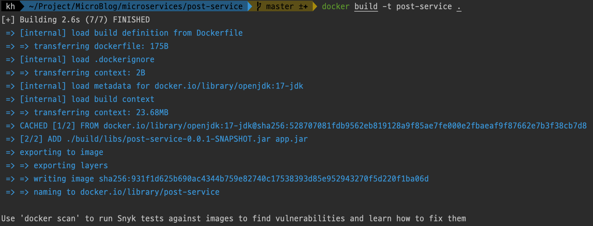
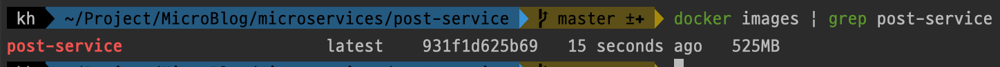
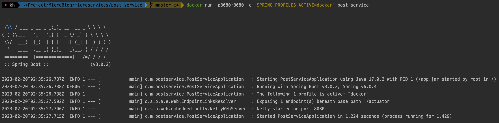
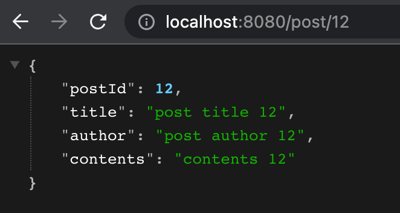
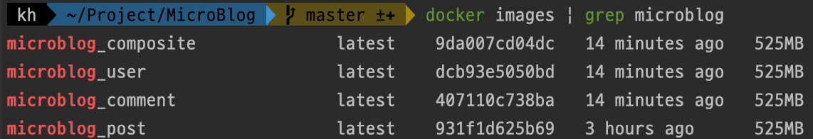
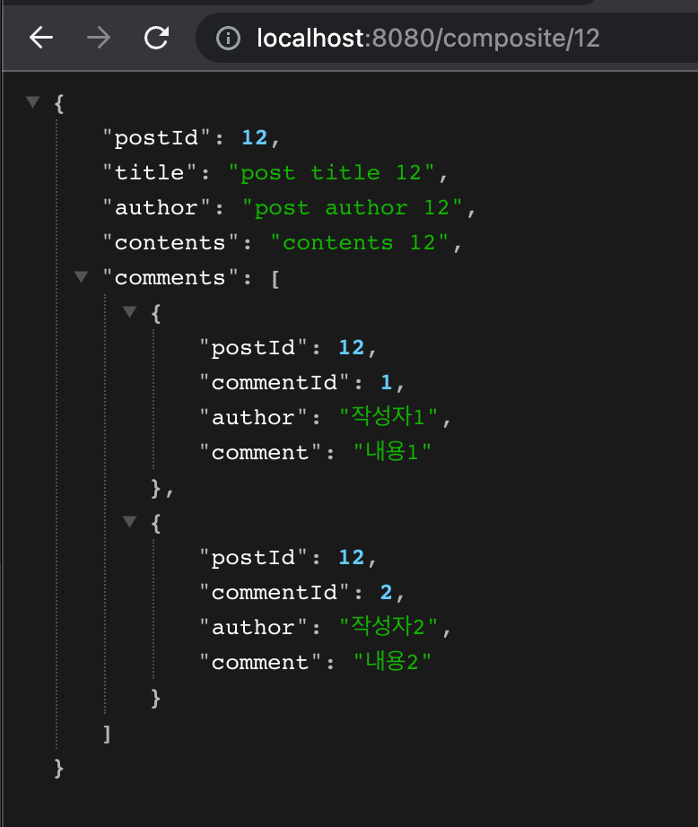

이번에는 지난번에 만들어본 microservice 환경을 각각 docker 환경으로 구성해보겠습니다.

# application.yml의 profile 설정

docker로 빌드하는 경우, 로컬환경과 docker로 빌드할때의 환경 설정이 달라야할 필요가 있습니다. 

따라서 `application.yml`에 다음과 같이 docker profile을 선언하고 아래로 환경설정을 해줍니다.

```yml
---
spring:
  config:
    activate:
      on-profile: docker
```

`post-service`의 전체 `application.yml`은 다음과 같습니다.

```yml
server:
  port: 8001
  error:
    include-message: always

logging:
  level:
    root: info
    com:
      microblog: debug

---
spring:
  config:
    activate:
      on-profile: docker

server:
  port: 8080
```

# Dockerfile 작성

이제 다음과같이 Docker Image를 빌드하기 위한 Dockerfile을 각 마이크로서비스 프로젝트에 작성해줍니다.

```Dockerfile
FROM openjdk:17-jdk

EXPOSE 8080

ADD ./build/libs/post-service-0.0.1-SNAPSHOT.jar app.jar

ENTRYPOINT ["java", "-jar", "/app.jar"]
```

각 라인의 의미는 다음과 같습니다.

- `FROM openjdk:17-jdk` : openjdk:17-jdk 이미지를 기반으로 이미지를 빌드합니다.
- `EXPOSE 8080` : 8080포트를 노출합니다.
- `ADD ./build/libs/post-service-0.0.1-SNAPSHOT.jar app.jar` : 실행할 파일을 app.jar이라는 이름으로 추가합니다.
- `ENTRYPOINT ["java", "-jar", "/app.jar"]` : 컨테이너가 시작할 때 실행할 명령어를 지정합니다.

# 이미지 생성

위에서 작성한 Dockerfile을 빌드해 이미지를 생성하기 위해서는 다음과 같은 과정을 거칩니다.

1. 프로젝트 build하기

    ```bash
    ./gradlew :microservices:post-service:build   
    ```

2. docker build하기
    ```bash
    cd microservices/post-service

    docker build -t post-service .
    ```

    다음과 같이 출력되며 build가 완료되는 것을 볼 수 있습니다.

    

3. image 확인하기

    이제 다음명령어를 통해 이미지와 같이 정상적으로 빌드되어 image로 만들어진것을 볼 수 있습니다.
    ```bash
    docker images | grep post-service
    ```

    

# 컨테이너 실행

만들어진 image를 실행하려면 다음 명령어를 이용해 실행이 가능합니다.

이때 해당 서비스의 profile을 선택하기 위해 `-e "SPRING_PROFILES_ACTIVE=docker"`를 통해 argument를 전달합니다.

```bash
docker run -p8080:8080 -e "SPRING_PROFILES_ACTIVE=docker" post-service
```

이제 정상적을 동작하는 것을 볼 수 있습니다. 여기서 주의해야할것은 `The following 1 profile is active "docker"`가 출력되면서 정상적으로 docker profile이 선택된것을 확인해야합니다.



그리고 정상적으로 요청이 처리되는것을 볼 수 있습니다.



<br/>

# Compose로 일괄 실행

하지만 마이크로서비스 환경에서 많은 서비스들을 각각 명령어를 작성해 실행하는 것은 매우 불편하고 비효율적입니다.

그리고 port나 volume등 다양한 Docker 옵션들이 있다면 더 조심해야합니다.

하지만 docker-compose를 이용하면 하나의 파일로 모든 설정을 저장하고 일괄적으로 실행이 가능합니다.

<br/>

## Composite Service 설정하기

composite 서비스에서는 다른 마이크로서비스를 접근해야합니다. 따라서 docker 환경에서도 다른 컨테이너의 위치를 알아야합니다.

따라서 다음과 같이 docker profile 아래에 다른 마이크로서비스의 host, port를 정의해줍니다. 

이때, host는 컨테이너 이름으로 지정하고, port는 docker profile에서 설정한 8080 포트를 지정해줍니다.

```yml
server:
  port: 8000
  error:
    include-message: always

app:
  post:
    host: localhost
    port: 8001
  comment:
    host: localhost
    port: 8002
  user:
    host: localhost
    port: 8003

logging:
  level:
    root: info
    com:
      microblog: debug

---
spring:
  config:
    activate:
      on-profile: docker

server:
  port: 8080

app:
  post:
    host: post
    port: 8080
  comment:
    host: comment
    port: 8080
  user:
    host: user
    port: 8080
```

이제 docker-compose.yml를 다음과 같이 작성합니다.

```yml
version: "2.1" # docker-compose의 버전

services:
  post:
    build: microservices/post-service
    mem_limit: 350m  # 최대 메모리 제한
    environment:
      - SPRING_PROFILES_ACTIVE=docker

  comment:
    build: microservices/comment-service
    mem_limit: 350m
    environment:
      - SPRING_PROFILES_ACTIVE=docker

  user:
    build: microservices/user-service
    mem_limit: 350m
    environment:
      - SPRING_PROFILES_ACTIVE=docker

  composite:
    build: microservices/composite
    mem_limit: 350m
    ports: 
      - "8080:8080" # composite의 경우 외부로 8080 port 노출
    environment:
      - SPRING_PROFILES_ACTIVE=docker
```

작성을 완료했으면 프로젝트를 빌드하고, compose를 빌드합니다.

```bash
./gradlew build

docker-compose build
```

다음 명령어를 통해 image를 찾아보면 정상적으로 이미지가 만들어진것을 볼 수 있습니다.

```bash
# docker images | grep [프로젝트 이름]
docker images | grep microblog
```



<br/>

그리고 다음 명령어를 통해 일괄적으로 컨테이너를 실행할 수 있습니다.

이때 -d를 추가해주면 terminal과 분리된 상태로 컨테이너를 실행할 수 있습니다.

```bash
docker-compose up -d
```

그리고 composite 서비스의 노출된 포트로 요청을 보내면 정상적으로 요청이 처리되는 것을 볼 수 있습니다.



컨테이너를 종료하려면 다음과같이 실행하면 됩니다.

```bash
docker-compose down
```

# 참고 및 출처

- 매그너스 라슨. 『스프링으로하는 마이크로서비스 구축』. 에이콘, 2019.
- [[Docker] Dockerfile 개념 및 작성법](https://wooono.tistory.com/123)
- [Dockerfile에서 자주 쓰이는 명령어](https://www.daleseo.com/dockerfile/)
- [Spring 프로젝트로 Docker Image 만들기](https://kimtaehyun98.tistory.com/150)