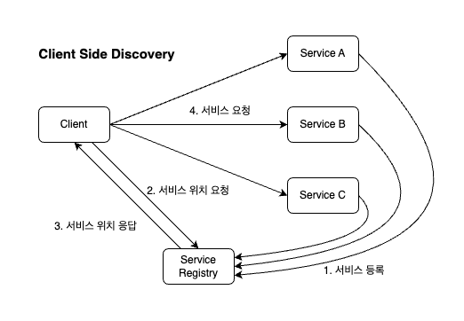
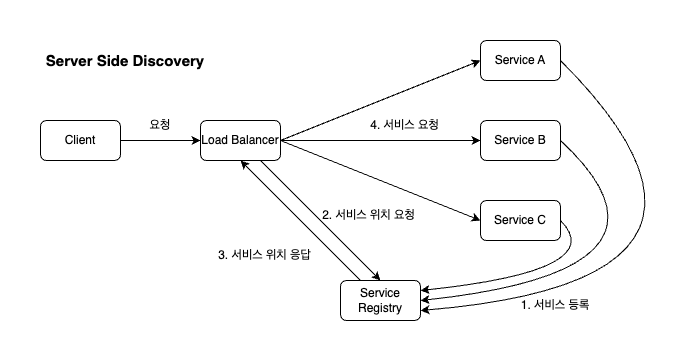
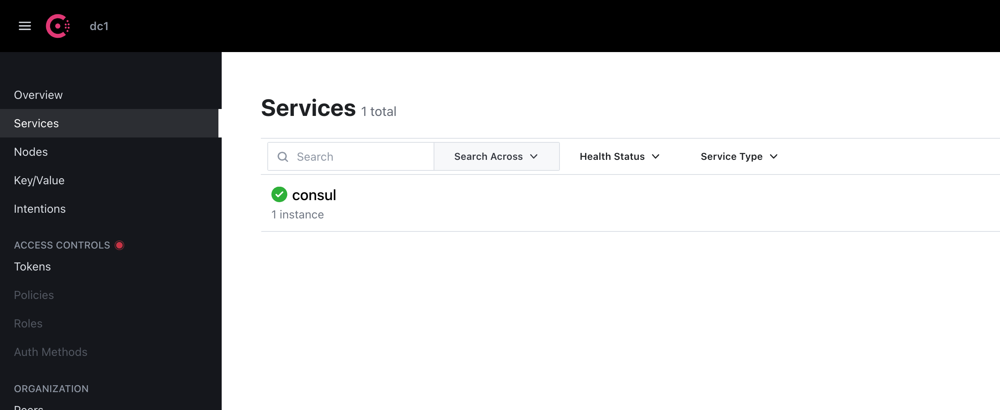
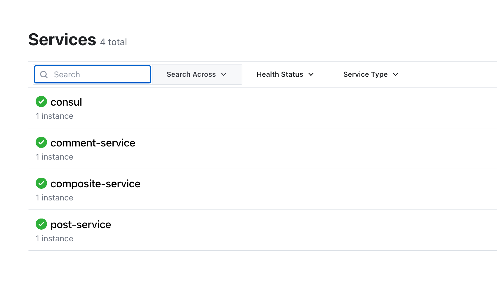

# Service Discovery란?

마이크로서비스 환경에서 각 서비스 간의 통신을 하기 위해서는 각 서비스의 IP 주소와 Port를 바탕으로 통신을 합니다.

하지만 IP 주소가 변하거나 서비스가 동적으로 생성되도록 구현하면서 IP를 수동으로 대응하기에는 한계가 있습니다.

따라서 자동으로 IP와 Port를 찾아 통신을 하도록 구현해야 합니다. 이를 Service Discovery라고 합니다.

서비스 디스커버리를 구현하는 방식으로 `Client Side Discovery`와 `Server Side Discovery`가 있습니다.

두 방식의 차이점은 Server의 IP 주소와 Port를 Client가 알 필요가 있는지 없는지 입니다.




## Eureka vs Consul vs ZooKeeper vs etcd

Service Discovery 툴에는 Eureka, Consul, ZooKeeper, etcd 등 다양한 툴이 있습니다.

<style>
.discovery {
  border-bottom: solid 1px;
}
.discovery td {
  border: none;
}
</style>

<table>
  <thead>
    <tr>
      <th>툴</th>
      <th>특징</th>
      <th>장점</th>
      <th>단점</th>
    </tr>
  </thead>
  <tbody class="discovery">
    <tr>
      <td rowspan="4">Eureka</td>
      <td> Server Side Discovery 시스템 </td>
      <td> 간편하다 </td>
      <td> Netflix에서 개발을 중단 </td>
    </tr>
    <tr>
      <td> 자가 회복 기능제공 </td>
      <td> 자가 회복 기능으로 신뢰성이 높음 </td>
      <td>  </td>
    </tr>
    <tr>
      <td> REST API 제공  </td>
      <td> 서버 가용성을 확인 가능 </td>
      <td>  </td>
    </tr>
    <tr>
      <td> </td>
      <td> Spring Cloud와의 호환성이 높음 </td>
      <td>  </td>
    </tr>
  </tbody>
  <tbody class="discovery">
    <tr>
      <td rowspan="4">Consul</td>
      <td> Server Side Discovery 시스템 </td>
      <td> 서비스 검색과 구성 관리 기능이 뛰어남 </td>
      <td> 설치 및 설정이 복잡 </td>
    </tr>
    <tr>
      <td> 분산 시스템에서의 서비스 검색 및 구성 관리, 다양한 기능 제공 </td>
      <td> 다양한 기능 제공으로 유연한 분산 시스템 구성 가능 </td>
      <td> 강력한 기능 때문에 학습이 필요 </td>
    </tr>
    <tr>
      <td>  </td>
      <td> 서버 가용성 확인 가능 </td>
      <td> 기존 시스템과의 호환성이 떨어질 수 있음 </td>
    </tr>
    <tr>
      <td> </td>
      <td> 대규모 분산 시스템에서도 성능 유지 가능 </td>
      <td>  </td>
    </tr>
  </tbody>
  <tbody class="discovery">
    <tr>
      <td rowspan="3">ZooKeeper</td>
      <td> Server Side Discovery 시스템 </td>
      <td> 안정성 높음 </td>
      <td> 설치 및 설정이 복잡 </td>
    </tr>
    <tr>
      <td> Configuration Management 제공 </td>
      <td> 네이밍 서비스 및 구성 관리 기능이 뛰어남 </td>
      <td> 학습이 필요 </td>
    </tr>
    <tr>
      <td></td>
      <td> 대규모 분산 시스템에서도 성능 유지 가능</td>
      <td> 성능이 다른 시스템에 비해 떨어질 수 있음  </td>
    </tr>
  </tbody>
  <tbody class="discovery">
    <tr>
      <td rowspan="4">etcd</td>
      <td> Server Side Discovery 시스템 </td>
      <td> 네이밍 서비스와 구성 관리 기능이 뛰어남 </td>
      <td> 설치 및 설정이 복잡 </td>
    </tr>
    <tr>
      <td> Distributed Key-Value Store 제공 </td>
      <td> Raft Consensus Algorithm으로 안정성 높음 </td>
      <td> 일부 시스템에서는 ZooKeeper보다 성능이 떨어질 수 있음 </td>
    </tr>
    <tr>
      <td> Configuration Management 제공 </td>
      <td> 대규모 분산 시스템에서도 성능 유지 가능 </td>
      <td> </td>
    </tr>
    <tr>
      <td> Raft Consensus Algorithm 지원 </td>
      <td> </td>
      <td>  </td>
    </tr>
  </tbody>
</table>

<br/>

# Discovery 서버 구축하기

이제 Consul을 이용해서 Service Discovery 기능을 구현해보겠습니다.

그러기 위해서는 Consul 서버를 설치하고 Spring 프로젝트들이 가입하도록 구현해야 합니다.

## Docker 이미지 설치하기

우선 바로 PC에 설치하는 것보다 Docker 이미지로 설치하고 컨테이너로 실행해 테스트하도록 구현해보겠습니다.

문저 consul 이미지를 받고 8500 포트를 연결하면서 컨테이너를 실행해줍니다.

```bash
docker pull consul

docker run -d --name consul -p 8500:8500 consul

docker ps - a # consul이 정상적으로 UP 되어있어야 합니다.
```

정상적으로 컨테이너가 실행되고 http://localhost:8500 접속시 아래 이미지와 같이 Consul 모니터링 페이지가 나타나는 것을 볼 수 있습니다.



<br/>

# Discovery 클라이언트 구현하기

Consul 서버를 정상적으로 실행했으니 이제 각각의 마이크로서비스를 Consul에 등록하는 작업을 진행해야합니다.

<br/>

## Post와 Comment서버 수정

우선 consul discovery 스타터에 대한 의존성을 추가하고 dependencyManagement를 다음과 같이 추가해줍니다.

```gradle
dependencies {
  implementation 'org.springframework.cloud:spring-cloud-starter-consul-discovery:3.0.4'
}

dependencyManagement {
	imports {
		mavenBom "org.springframework.cloud:spring-cloud-dependencies:2022.0.1"
	}
}
```

이제 자신의 서비스 이름과 consul 서버의 위치를 application.yml에 추가해줍니다.

```yml
spring:
  application:
    name: comment-service
  cloud:
    consul:
      host: localhost # consul주소
      port: 8500
```

## Composite 서버 수정

composite 서버도 다른 마이크로서비스와 같이 의존성 및 dependencyManagement를 추가해줍니다.

그리고 application.yml도 작성해줍니다.

```gradle
dependencies {
  implementation 'org.springframework.cloud:spring-cloud-starter-consul-discovery:3.0.4'
}

dependencyManagement {
	imports {
		mavenBom "org.springframework.cloud:spring-cloud-dependencies:2022.0.1"
	}
}
```

```yml
spring:
  application:
    name: compoiste-service
  cloud:
    consul:
      host: localhost # consul주소
      port: 8500
```

이제 더이상 다른 마이크로서비스의 Host와 Port를 알 필요가 없으므로 다음 내용을 제거해줍니다.
```yml
app:
  post:
    host: localhost
    port: 8001
  comment:
    host: localhost
    port: 8002
  user:
    host: localhost
    port: 8003
```

composite 서버의 경우 다른 서버에 대한 위치를 알아야하기 때문에 @LoadBalanced Annotation을 통해 로드 밸런싱된 RestTemplate을 생성합니다.

```java
@Configuration
public class Config {

    @Bean
    @LoadBalanced // 추가
    RestTemplate restTemplate() {
        return new RestTemplate();
    }
}
```

그리고 CompositeControllerImpl에서 `http://hostIp:port`로 작성했던 URL을 다음과 같이 서비스 이름으로 대체해줍니다.

```java
public CompositeControllerImpl(RestTemplate restTemplate) {
    POST_URL = "http://post-service/post";
    COMMENT_URL = "http://comment-service/comment";

    this.restTemplate = restTemplate;
    mapper = new ObjectMapper();
    mapper.registerModule(new JavaTimeModule());
}
```

그리고 빌드 후 실행하면 Consul 페이지에 다음과같이 정상적으로 등록되고 요청이 정상적으로 동작하는것을 확인할 수 있습니다.



<br/>

# Docker Compose 수정

이제 Consul 서버도 Docker Compose에 추가해 한번에 관리가 가능하도록 수정해보곘습니다.

<br/>

## application.yml의 docker profile 수정

우선 docker 환경에서의 경우 같이 실행중인 consul 컨테이너를 가리키도록 host를 수정해줍니다. 

```yml
---
spring:
  config:
    activate:
      on-profile: docker

  cloud:
    consul:
      host: consul

server:
  port: 8080
```

<br/>

## docker-compose.yml 수정

이제 다음과 같이 compose 파일을 작성하고 빌드 후 실행하면 정상적으로 동작하는 것을 확인할 수 있습니다.

```yml
version: "2.1"

services:
  consul:
    image: consul
    ports:
      - "8500:8500"

  post:
    build: microservices/post-service
    mem_limit: 350m
    environment:
      - SPRING_PROFILES_ACTIVE=docker

  comment:
    build: microservices/comment-service
    mem_limit: 350m
    environment:
      - SPRING_PROFILES_ACTIVE=docker

  user:
    build: microservices/user-service
    mem_limit: 350m
    environment:
      - SPRING_PROFILES_ACTIVE=docker

  composite:
    build: microservices/composite
    mem_limit: 350m
    ports:
      - "8080:8080"
    environment:
      - SPRING_PROFILES_ACTIVE=docker
```


# 참고 및 출처
- [클라우드 환경 Service Discovery 개념 정리](https://wildeveloperetrain.tistory.com/202)
- [Spring Cloud service discovery using Spring Cloud Consul](https://www.section.io/engineering-education/spring-cloud-consul/)
- [[Docker] Consul 설치 하기 (Feat.Mac)](https://kabby91.tistory.com/44)
- [Spring Cloud Consul - cloud.spring.io](https://cloud.spring.io/spring-cloud-consul/reference/html/)
- [Spring Cloud Consul - docs.spring.io](https://docs.spring.io/spring-cloud-consul/docs/current/reference/html/)
- [Microservice - Spring Cloud Consul | Service Discovery | Java Techie](https://www.youtube.com/watch?v=Dd9-UxrNiD0)
- [A Quick Guide to Spring Cloud Consul - baeldung](https://www.baeldung.com/spring-cloud-consul)