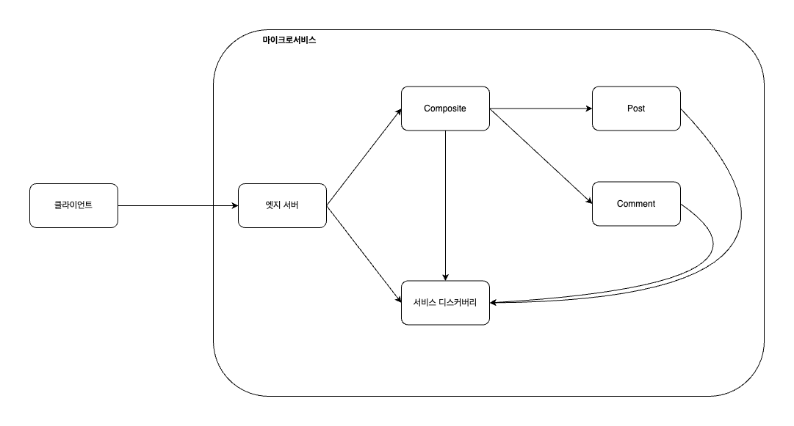
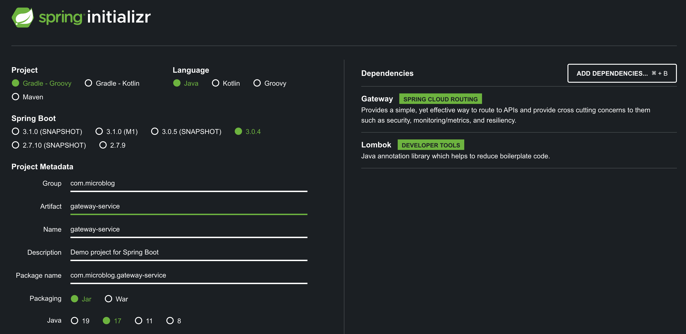
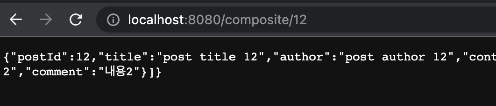

# Edge Server란?

마잌크로서비스 환경에서는 일부 마이크로서비스만 외부에 공개하고 나머지 마이크로서비스는 외부에서 접근하지 못하도록 숨겨야할 필요성이 있습니다.

이때 엣지서버를 통해 외부의 요청을 수신받고 다른 마이크로서비스에 요청을 전달하도록 구현해 나머지 마이크로서비스를 외부에서 숨기도록 해줄 수 있습니다.



저희는 이번에 Spring Cloud Gateway를 통해 엣지서버를 구현해보겠습니다.

<br/>

# Gateway Serivce 프로젝트 생성

우선 [https://start.spring.io/](https://start.spring.io/)에 접속해서 다음과 같이 Gateway 의존성을 추가해 프로젝트를 생성해줍니다.



그리고 다음 파일 구조와 같이 gateway 프로젝트를 추가해줍니다.

```text
[Project Root]
 |-- gradle
 |
 |-- api
 |-- microservices
 |   |-- gateway-service (추가)
 |   |-- composite
 |   |-- post-service
 |   |-- comment-service
 |   '-- user-serivce
 |-- util
 |
 |-- .gitignore
 |-- gradlew
 |-- gradlew.bat
 '-- settings.gradle   
```

이때, Gateway 프로젝트의 gradle 파일은 필요없으므로 다음 명령어를 통해 제거해줍니다.

```bash
find microservices -depth -name "gradle" -exec rm -rfv "{}" \;
find microservices -depth -name "gradlew*" -exec rm -rf "{}" \;
```

그리고 settings.gradle에 gateway를 추가해줘 빌드하도록 설정해줍니다.

```gradle
include ':api'
include ':util'

include ':microservices:gateway-service' // 추가
include ':microservices:composite'
include ':microservices:comment-service'
include ':microservices:post-service'
include ':microservices:user-service'
```

이때, 엣지서버는 다른 서버에 대한 주소정보를 알기위해 consul discovery 의존성을 build.gradle에 추가해줍니다.

```gradle
implementation 'org.springframework.cloud:spring-cloud-starter-consul-discovery:3.0.4'
```

<br/>

# Gateway 설정하기

이제 Consul 서버에 대한 정보와 Gateway의 라우팅 정보를 작성해줍니다.

Gateway의 라우팅 정보는 다음과 같습니다.

- id : 라우트 ID를 정의합니다.
- uri : 대상 URI를 정의합니다.
- predicates : 요청을 필터링하는데 사용합니다.
- filters : 요청 및 응답에 대한 필터를 정의합니다. (현재 프로젝트에서는 사용하지 않았습니다.)

```yml
logging:
  level:
    root: INFO

spring:
  application:
    name: gateway-service
  cloud:
    consul:
      host: localhost
      port: 8500

    gateway:
      routes:
        - id: composite
          uri:
            lb://composite-service

          predicates:
            - Path=/composite/**
```

이제 빌드하고 실행하면 다음과 같이 Gateway를 통해 정상적으로 요청이 라우팅되는 것을 볼 수 있습니다.



<br/>

# Docker 사용하기

이제 Gateway도 Docker환경에서 동작하도록 구현해주겠습니다.

첫번째로, Dockerfile을 다음과 같이 작성해줍니다.

```docker
FROM openjdk:17-jdk

EXPOSE 8080

ADD ./build/libs/gateway-service-0.0.1-SNAPSHOT.jar app.jar

ENTRYPOINT ["java", "-jar", "/app.jar"]
```

그리고 application.yml에 docker profile을 추가해줍니다.

```yml
---
spring:
  config:
    activate:
      on-profile: docker

  cloud:
    consul:
      host: consul
```

마지막으로 docker-compose.yml에 다음과 같이 gateway를 추가해줍니다.

```yml
gateway:
    build: microservices/gateway-service
    mem_limit: 350m
    ports:
        - "8080:8080" # composite에서 이동
    environment:
        - SPRING_PROFILES_ACTIVE=docker
```

그리고 모든 프로젝트를 빌드 후 compose 파일을 빌드 및 실행하면 다음과 같이 정상적으로 요청받는 것을 볼 수 있습니다.


<br/>

# 참고 및 출처

- [에지 서버 패턴](https://clarkshim.tistory.com/145)
- [Spring Cloud Gateway를 이용한 API Gateway 구축해보기](https://wildeveloperetrain.tistory.com/207)
- [Spring Boot Microservices with Consul, Spring Cloud Gateway and Docker](https://blog.devops.dev/spring-boot-microservices-with-consul-spring-cloud-gateway-and-docker-789b624d1d32)
