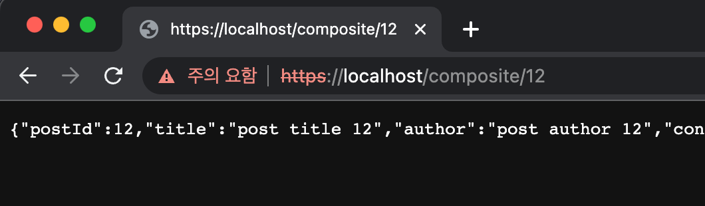

# HTTPS란?

HTTP란 Hyper Text Transfer Protocol의 약자로 HTML과 같은 Hyper Text를 전송하기 위한 프로토콜입니다.

이 프로토콜은 정보를 텍스트로 주고받기 때문에 네트워크에서 전송 신호를 가로채는 경우 데이터가 유출될 수 있습니다.

이러한 취약점을 해결하기 위해 보안 요소를 추가한 프로토콜이 HTTPS입니다.

HTTPS를 사용하는 경우 데이터를 주고받을 때 모든 내용이 암호화됩니다.

자세한 내용은 [HTTPS란? (동작방식, 장단점)](https://rachel-kwak.github.io/2021/03/08/HTTPS.html) 여기서 확인 가능합니다.

<br/>

# 인증서 발급하기

인증서를 발급하는 방법은 인증기관에서 인증서를 발급하는 방법과 자체적으로 인증서를 발급하는 방법이 있습니다.

인증기관에서 인증서를 발급받는 것이 권장되지만 학습 목적이기 때문에 자체 인증키로 구현하겠습니다.

<br/>

## 자체 인증서 발급하기

우선 첫번째로 다음 명령어를 통해 pem 방식의 인증서를 발급합니다.

```bash
openssl req -x509 -newkey rsa:4096 -keyout key.pem -out cert.pem -days 365
```

<br/>

## PEM을 PKCS12로 변환하기

그리고 발급받은 PEM 인증서를 PKCS12로 변환해줘야합니다.

따라 다음 명령어를 통해 PEM 인증서를 `keystore.p12` 인증서로 변환해줍니다.

```bash
openssl pkcs12 -export -inkey key.pem -in cert.pem -out keystore.p12 -name microblog
```

<br/>

# 인증서 적용하기

이제 마이크로서비스의 `게이트웨이 서비스`에서 외부 요청은 HTTPS 요청을 받기위해 application.yml을 다음과 같이 작성해줍니다.

```yml
server:
  port: 443 # https port

  ssl:
    key-store: /Users/kh/Project/MicroBlog/microservices/gateway-service/keystore.p12 # 인증서 위치
    key-store-password: mypassword # 인증서 비밀번호
    key-store-type: PKCS12
    key-alias: microblog # 인증서 이름

```

<br/>

이제 다음과 같이 https로 요청을 보냈을 때 정상적으로 동작하는 것을 확인할 수 있습니다.



<br/>

> https 요청이지만 `주의 요함`이 뜨는 이유 <br/><br/>
> 현재 구현한 방법은 https 요청이긴 하지만 인증서가 자체 인증서이기 때문에 보안적으로 신뢰할 수 없어서 그렇습니다. <br/>
> 따라서 공인 인증기관에서 발급한 인증서를 바탕으로 구현하면 해당 경고가 사라집니다.

<br/>

# docker 적용하기

이제 docker에서도 https 통신을 하기위한 설정을 해주겠습니다.

첫번째로 application.yml에서 다음과 같이 key-store 위치를 설정해줍니다.

```yml
---
spring:
  config:
    activate:
      on-profile: docker

  cloud:
    consul:
      host: consul

server:
  ssl:
    key-store: /keystore.p12
```

그리고 Dockerfile에서 다음과 같이 인증서를 복사해 docker 컨테이너에서도 해당 인증서를 사용 가능하도록 설정해줍니다.

```docker
FROM openjdk:17-jdk

EXPOSE 8080

EXPOSE 443/tcp

ADD ./build/libs/gateway-service-0.0.1-SNAPSHOT.jar app.jar

COPY ./keystore.p12 /keystore.p12

ENTRYPOINT ["java", "-jar", "/app.jar"]
```

그리고 8080 포트 대신 443 포트를 개방하면 정상적으로 https 통신하는 것을 확인 가능합니다.

```yml
  gateway:
    build: microservices/gateway-service
    mem_limit: 350m
    ports:
#      - "8080:8080"
      - "443:443"
    environment:
      - SPRING_PROFILES_ACTIVE=docker
```

<br/>

# 참고 및 출처

- [HTTPS란? (동작방식, 장단점)](https://rachel-kwak.github.io/2021/03/08/HTTPS.html)
- [SpringBoot 무료 SSL 인증서 적용하기 (Certbot)](https://subbak2.com/110)